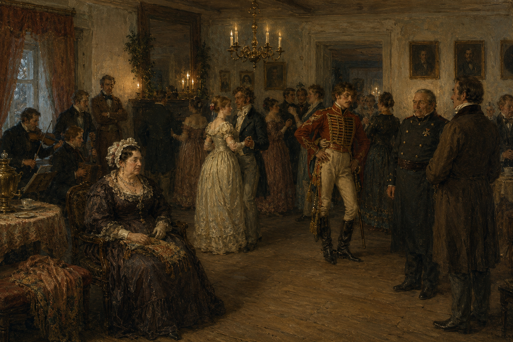

<!-- original -->

Через десять лет после разгрома декабристов жизнь в провинции выглядит почти нормально. Рауты, визиты, светские разговоры, новости из столицы. Почти как раньше.

Только разговаривают осторожнее. И смотрят внимательнее – за собой и за другими.

В поместье Самохваловых собираются очень разные люди: беспечные сибариты и деловые люди; скептики и фантазёры; те, кому есть что скрывать, и те, кому поручено это раскрывать; люди с амбициями и люди с убеждениями; гости, которым нельзя задерживаться, и хозяева, которым не хочется лишних хлопот. Ни один из них не знает, что такое полыхнуло в небе над соседским поместьем. Жизнь ни одного из них не останется прежней после этого.

Роли – здесь: https://telegra.ph/Formula-kontakta-roli-06-10

Многие персонажи имеют прототипами реальных людей с интересными историями, которые помогут нам создать атмосферу игры.
