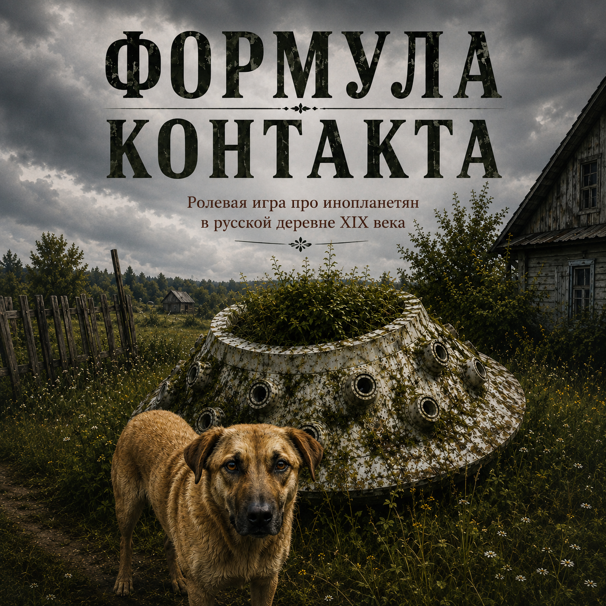

<!-- original -->

Если вы не любите бегать по лесу в дурацком наряде и колотить друзей резиновым мечом, это ещё не значит, что ролевые игры – не для вас. Может быть, вы любите Пушкина и Одоевского, вам нравятся советские фильмы про XIX век, под историческим соусом приглашавшие поразмышлять о современности, или вам по душе научная фантастика, проверяющая границы нашей человечности столкновением с непривычным? «Формула контакта» – игра про 1835 год, время, до боли напоминающее современную Россию, и про инопланетян, с которыми не надо сражаться. Или надо – если эти иноагенты угрожают вашей карьере, душевному спокойствию и положению в вертикали власти.

Заходите в группу игры @formula_kontakta посмотреть – а может и занять одну из оставшихся свободных ролей. Игра будет в сентябре, но мест осталось уже мало.

---

12-13 сентября 2026 г.
2 дня, коттедж, 18 игроков.
Размер взноса будет понятен, когда определимся с локацией и питанием, но что-то в районе 25к драм.
В группе @formula_kontakta вся важная информация в закрепах.

