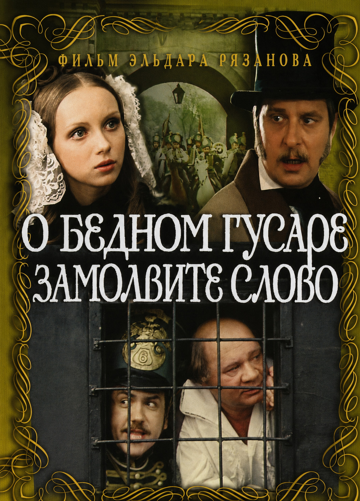
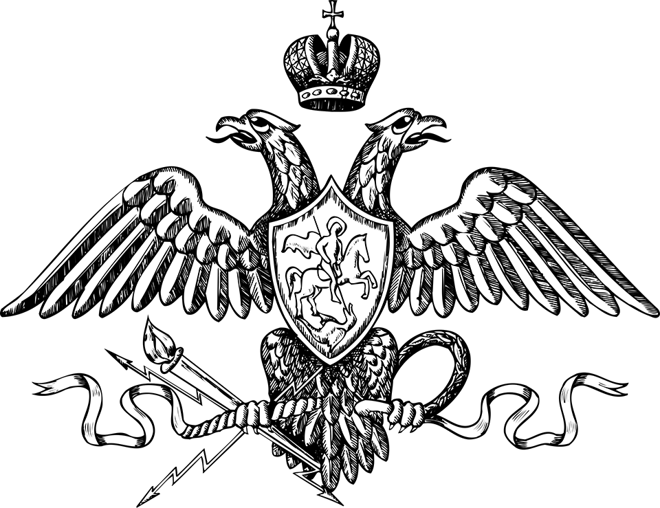

<!-- original -->

Фильм Рязанова – не столько о XIX веке, сколько о том, как выглядит николаевская эпоха глазами человека конца XX века. Это удобная промежуточная точка, чтобы не прыгать сразу на двести лет назад, один из взглядов на эпоху и вечный российский спор о государстве, свободе и порядке. В серии таких постов соберём пазл, который поможет нам понять персонажей нашей игры, сделать их живыми и объёмными. Читаем: https://telegra.ph/O-bednom-gusare-zamolvite-slovo-06-24

---

# «О бедном гусаре замолвите слово»
***Трагикомедия про эпоху, которая не желает уходить насовсем***

*https://www.kinopoisk.ru/film/81430*

Снимая в 1980 году фильм про николаевскую Россию, Эльдар Рязанов конечно говорил не только и не столько о XIX веке. За историческими мундирами, провинциальными балами и любительским театром легко угадывался поздний СССР – мир, где неосторожное слово могло испортить карьеру, где люди привыкли различать сказанное вслух и сказанное среди своих, где государство интересовалось не только поступками, но и настроениями. Историческая дистанция позволяла говорить о вещах, которые не принято было называть прямо. Говорят, руководство КГБ потребовало, чтобы в фильме не упоминалось Третье Отделение, а главный антагонист фильма не назывался жандармским офицером, как это было по сценарию, – параллели для них были слишком неприятными. Как и сейчас.

Начало 1840-х. В небольшой провинциальный город приезжает чиновник Третьего отделения – политической полиции Российской империи. Он не устраивает обысков и арестов, не появляется с солдатами и громкими распоряжениями. Наоборот: знакомится с местным обществом, посещает спектакли, ведёт приятные разговоры, наблюдает. Его задача – понять, кто чем живёт, кто что говорит и кому можно доверять. При всём этом никакого заговора вокруг него нет. Никто не готовит восстание. Люди влюбляются, спорят, принимают гостей, играют в театре, строят планы на будущее. Но когда настоящая оппозиция разгромлена, политическую полицию начинают интересовать и такие места. Когда публичное пространство зачищено, настоящие взгляды людей узнают не в прессе, а за дружеским ужином, на репетиции или в компании людей, которых человек считает своими. Чтобы потом было что предъявить на допросе.

К этому времени после восстания декабристов прошло десять лет. Россия усвоила урок. Все видели, чем заканчиваются попытки открыто спорить с государством. Поэтому говорить стали осторожнее. Намёками. Полуфразами. Не при тех, кого знаешь недостаточно хорошо. Сама система контроля была куда менее многочисленной, чем можно представить: корпус жандармов насчитывал всего несколько тысяч человек на огромную империю. Но дело было не в количестве. Система держалась прежде всего на общественной атмосфере. Донос не считался чем-то исключительным. Сообщить начальству о подозрительных разговорах можно было из карьерных соображений, из осторожности, из искреннего желания послужить государству или просто «на всякий случай». Репутация благонадёжного человека открывала двери. Репутация неблагонадёжного – закрывала.

Важно понимать и другое. Жандармы – не обычная полиция, как Доложейко в нашей игре. Полиция ловила преступников, расследовала кражи, поддерживала порядок и боролась с пожарами. Для помещика полицейский – помощник в усмирении крестьян, для военного – гражданский чин, которому он никак не подотчётен. Жандармерия – другое. Это новая структура, обеспечивающая политическую надёжность империи. После декабристов Николай I переформатировал государство. Для старого дворянства были важны происхождение, честь рода, офицерское достоинство, сословные права. Николай выстраивал вертикаль власти, скованную дисциплиной и лояльностью. Положение в чиновничьей иерархии значило больше, чем происхождение и старые привилегии. Корпус жандармов стал одним из символов этой новой системы: особой структурой, стоящей над ведомственными границами и подчинённой непосредственно императору.

Полковник Мерзляев в фильме не выглядит чудовищем и не считает себя злодеем. Напротив, он убеждён, что защищает порядок, стабильность и государственные интересы. Такие люди не воспринимают себя угнетателями. Они просто уверены, что безопасность важнее свободы, а подозрительность полезнее доверия. Наверное, именно поэтому фильм производит такое сильное впечатление. Он рассказывает не о терроре и не о массовом насилии. Он рассказывает об эпохе, где большинство людей стараются жить обычной жизнью, но постоянно помнят о невидимых границах дозволенного. О времени, когда все понимают правила игры, хотя почти никто не произносит их вслух. И когда слово «неблагонадёжный» может значить гораздо больше, чем кажется на первый взгляд.

Если после фильма вам стало чуть не по себе – вы поймали нужную интонацию. В таком мире живёт Горихвостова-Чаадаевская, сосланная в провинцию за образ мыслей, который власть сочла опасным. В такой мир стремится Свербеев: для честолюбивого полицейского жандармерия – не страшилка, а вершина карьеры. С таким миром внутренне спорит Чарторыжский, которому легче понять врага на поле боя, чем жандарма, следящего за разговорами соотечественников. А на таких, как Самохвалов, этот мир в конечном счёте и держится – на людях, которые хотят не надзирать и не бунтовать, а просто спокойно жить. Но и перед ними порой этот мир ставит выбор: пожертвовать кусочком человечности – или уютом своей жизни.

