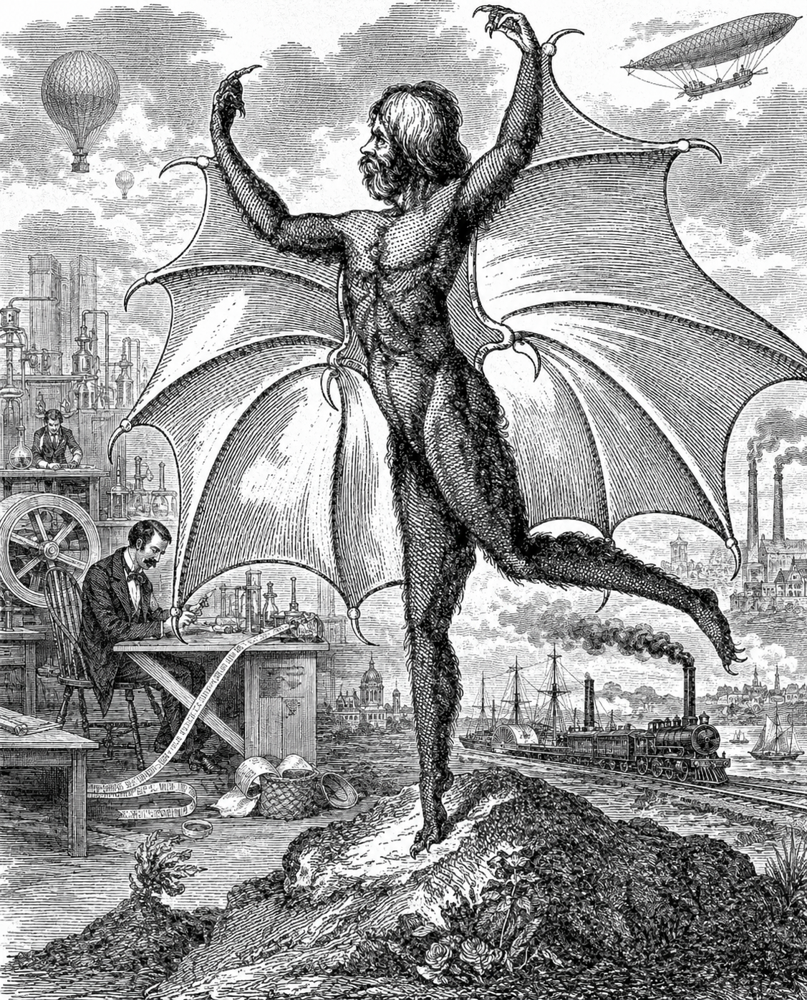

Мы выросли в мире, пронизанном научным знанием и научной фантастикой. Мы знаем о галактиках, эволюции и космических полётах, привыкли к образам инопланетян и иных миров, впитали множество книг, фильмов и игр от твёрдого sci-fi до космических опер. В 1835 году почти ничего этого не было. Давайте посмотрим, что же было, и постараемся взглянуть на мир глазами современников Пушкина и Николая I.
Читаем: https://telegra.ph/CHudesa-nauki-i-zagadki-prirody-06-26

---

# Чудеса науки и загадки природы
***Прогресс, наука и представления о неизведанном в России 1835 года***

1830-е – это без сомнений уже Новое время. Пароходы пересекают океаны, не завися от ветра. Железные дороги обещают невиданную скорость передвижения. Учёные исследуют электричество и создают первые мощные электродвигатели. Аэростаты совершают дальние перелёты, а астрономы измеряют расстояния до звёзд и открывают новые небесные тела. Человечеству кажется, что ещё немного – и будут раскрыты все тайны природы. Неудивительно, что в 1835 году тысячи людей поверили <a href="https://ru.wikipedia.org/wiki/%D0%91%D0%BE%D0%BB%D1%8C%D1%88%D0%BE%D0%B5_%D0%BB%D1%83%D0%BD%D0%BD%D0%BE%D0%B5_%D0%BD%D0%B0%D0%B4%D1%83%D0%B2%D0%B0%D1%82%D0%B5%D0%BB%D1%8C%D1%81%D1%82%D0%B2%D0%BE">Великой лунной мистификации</a> – газетной сенсации о том, что астроном Джон Гершель якобы обнаружил на Луне леса, животных и разумных крылатых существ. История была выдумкой, но сама мысль о жителях Луны многим казалась вполне правдоподобной.

Россия участвует в этом интеллектуальном подъёме вместе с Европой. В столичных гостиных и университетах обсуждают не только политику и литературу, но и науку. Читают книги по астрономии, спорят о природе комет, рассуждают о возможности жизни на других планетах. Космос воспринимается как огромная неизведанная область, полная загадок. Князь Владимир Одо́евский пишет роман <a href="https://ru.wikipedia.org/wiki/4338-%D0%B9_%D0%B3%D0%BE%D0%B4:_%D0%9F%D0%B5%D1%82%D0%B5%D1%80%D0%B1%D1%83%D1%80%D0%B3%D1%81%D0%BA%D0%B8%D0%B5_%D0%BF%D0%B8%D1%81%D1%8C%D0%BC%D0%B0">«4338-й год»</a>, где описывает мир мгновенной связи, управляемых летательных аппаратов и других технологий далёкого будущего. Русская научная фантастика появляется ещё до того, как для неё придумали само название.

Однако мир науки и смелых идей остаётся достоянием сравнительно узкого круга людей. Для большинства жителей империи жизнь течёт совсем иначе. Они передвигаются на лошадях, освещают дома свечами и лучинами, неделями ждут писем из дальних губерний. Миллионы крестьян не умеют читать и редко покидают пределы родного уезда. Их повседневность определяют урожай, подати, рекрутчина и смена времён года. Россия 1835 года живёт сразу в нескольких эпохах. В столичных салонах спорят о тайнах Вселенной и грядущих открытиях, а в тысячах деревень уклад мало отличается от того, каким он был столетия назад.

Поэтому неудивительно, что столкновение с чем-то по-настоящему непонятным люди той эпохи объяснили бы совершенно по-разному. Горихвостова-Чаадаевская, увлечённая философией, литературой и новейшими научными теориями, увидела бы в происходящем намёк на существование иных миров и сил, о которых человечество только начинает догадываться. Доктор Пирогов принялся бы искать естественные причины: редкую болезнь, массовое внушение, действие неизвестных природных факторов — и тем упорнее искал бы их, чем больше факты сопротивлялись объяснению. Сестра Ефросинья без колебаний заговорила бы о бесах, знамениях и духовной брани, тем более что окрестные звери и вправду начали вести себя так, словно понимают больше положенного.

Исправник Свербеев увидел бы прежде всего угрозу порядку и повод для расследования: если люди ведут себя странно, значит кто-то распространяет опасные слухи или скрывает преступление. Журналист Раскольниченко немедленно принялся бы собирать свидетельства для статьи о небывалых событиях, а граф Валемонте — искать в них чудо, способное наконец превзойти любой фокус. И лишь в одном они, вероятно, сошлись бы: в округе происходит нечто такое, для чего у них нет ни точного объяснения, ни даже подходящего слова.

