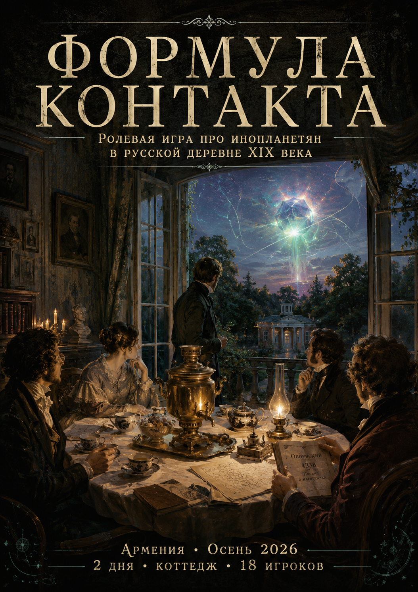

# Формула контакта. Ролевая игра про инопланетян в русской деревне XIX века

1835 год. Усадьба, чай, неспешный разговор ни о чём. Где-то рядом Пушкин дописывает «Капитанскую дочку», император ещё вздрагивает при слове «декабрь» и косится на Польшу, а князь Одоевский уже придумал интернет – просто называет его иначе. Все при деле, у каждого – своя жизнь, свои секреты и своя причина улыбаться шире, чем хочется. И вдруг с неба падает то, чему здесь нет названия: оно разумное, небесно-этичное (привет, реморализатор Амперяна) – и совершенно не представляющее, что делать дальше. Как, впрочем, и вы. Возможно, для начала придётся побыть его кошкой.

Приглашаем поиграть в инопланетян в русской деревне XIX века! В сетке ролей вы их не найдёте, а вот на игре – как знать?

Никакой мистики, твёрдый sci-fi в реалистичном историческом сеттинге! Приходи потрогать травку, проросшую меж расейских исторических корней!

Армения. 12-13 сентября 2026. 2 дня, коттедж, 18 игроков.

Ссылка на группу игры: https://t.me/formula_kontakta
Вопросы мастерам: @yuhmik

