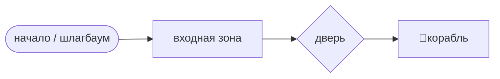
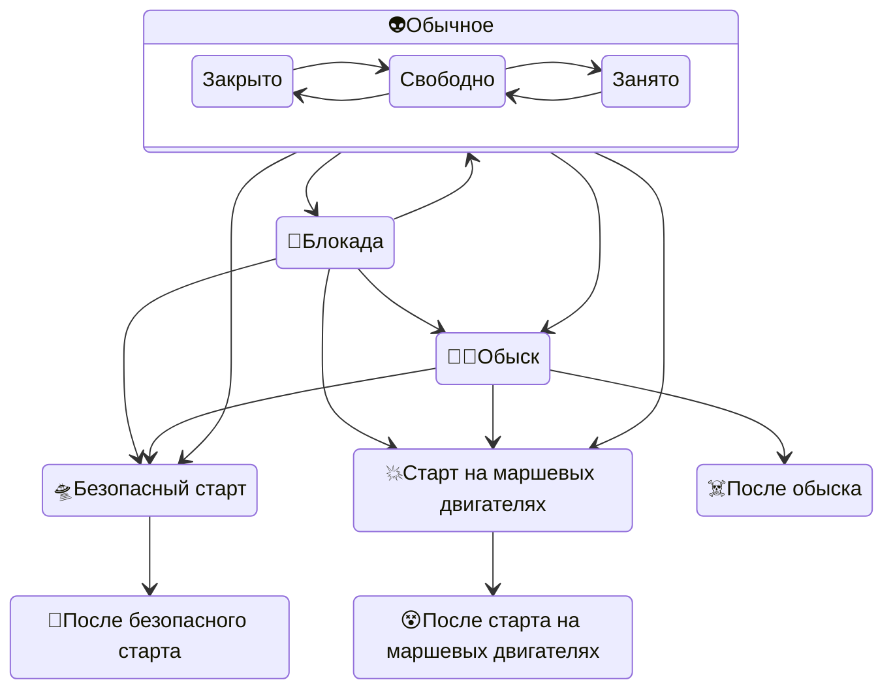

# Локация крушения корабля пришельцев

- расположена на территории поместья Горихвостовой, вблизи границы с поместьем Самохвалова (физически) и с церковным огородом (условно).
- у локации есть входная зона (коридор или проход) и собственно локация корабля, отделяемая запирающейся дверью.

- Обычно мастер встречает игроков во входной зоне в тёмном плаще, шёпотом даёт указания, не отвечая на вопросы. Он там – голос пространства, не персонаж. Проводит игроков либо обратно наружу, либо в локацию корабля.
- Особый режим – полицейская блокада. В начале входной зоны стоит шлагбаум и возможно офицер в мундире (переодетый мастер локации или игротехник).
- При отсутствии мастера во входной зоне локации висят таблички ("полицейский кордон" на шлагбауме, "блуждание во входной зоне" на запертой двери), объясняющие игрокам что делать.
- В локации корабля мастер локации отыгрывает инопланетянина в теле Ласневского. Игроки в серебристых плащах – инопланетяне из питомцев. Игроки в светящихся очках – люди со способностью «Общение с пришельцами».
- Подробности уровня посвящения игроков – в карточке "Уровни контакта".
- Подробности взаимодействия с игроками – в карточке "Пропуск в локацию".

**Состояния локации:**

