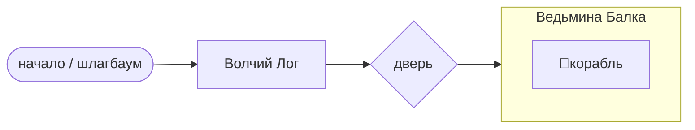
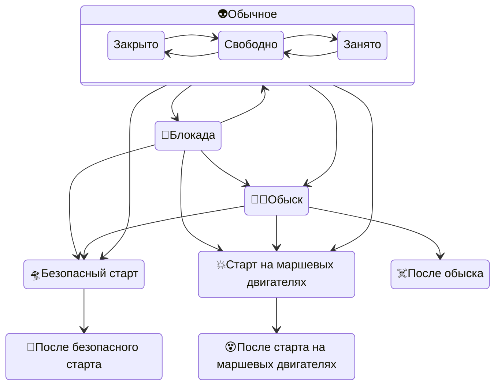

# Локация крушения корабля пришельцев

- расположена на территории поместья Горихвостовых, вблизи границы с поместьем Самохваловых (физически) и с церковным огородом (условно).
- состоит из двух сублокаций: Волчьего Лога и Ведьминой Балки.
- Волчий Лог – входная зона – единственный проход из остального полигона в Ведьмину Балку.
- На входе в Волчий Лог есть место для шлагбаума (с табличкой "Полицейский кордон"), который может установить полиция.
- Посреди Волчьего Лога висит табличка "Очень Странное Место".
- На переходе между Волчьим Логом и Ведьминой Балкой есть запирающаяся дверь (на неё при запирании вешается табличка "Блуждание в Волчьем Логе").
- Ведьмина Балка – собственно локация места крушения корабля пришельцев.

- Обычно мастер встречает игроков в Волчьем Логе в тёмном плаще, шёпотом даёт указания, не отвечая на вопросы. Он там – голос пространства, не персонаж. Проводит игроков либо обратно наружу, либо в Ведьмину Балку.
- Особый режим – полицейская блокада. В начале Волчьего Лога стоит шлагбаум и возможно офицер в мундире (переодетый мастер локации или игротехник).
- При отсутствии мастера в Волчьем Логе висят таблички ("полицейский кордон" на шлагбауме, "блуждание в Волчьем Логе" на запертой двери), объясняющие игрокам что делать.
- В Ведьминой Балке мастер локации отыгрывает инопланетянина в теле Ласневского. Игроки в серебристых плащах – инопланетяне из питомцев. Игроки в светящихся очках – люди со способностью «Общение с пришельцами».
- Подробности уровня посвящения игроков – в карточке "Уровни контакта".
- Подробности взаимодействия с игроками – в карточке "Пропуск в локацию".

**Состояния локации:**

