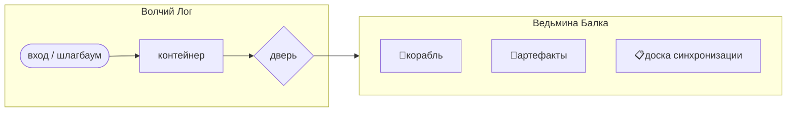
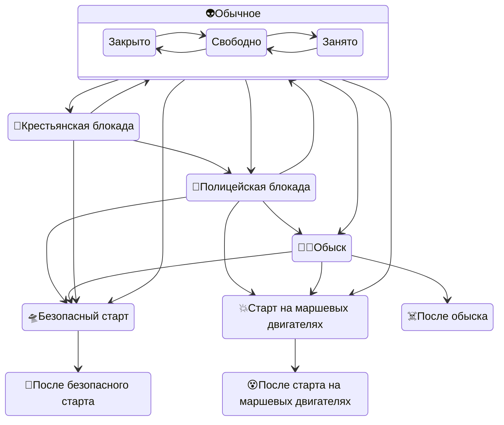

# Локация крушения корабля пришельцев

- расположена на территории поместья Горихвостовых, вблизи границы с поместьем Самохваловых (физически) и с церковным огородом (условно).
- состоит из двух сублокаций: **Волчьего Лога** и **Ведьминой Балки**.
- Волчий Лог – входная зона – единственный проход из остального полигона в Ведьмину Балку.
- На входе в Волчий Лог есть место для **шлагбаума** (с табличкой "Полицейский кордон"), который может установить полиция, или "ежа" из веток (с табличкой "Крестьянские волнения"), который могут установить крестьяне при волнениях.
- Посреди Волчьего Лога стоит **контейнер для плащей и очков**, на нём табличка "Очень Странное Место".
- На переходе между Волчьим Логом и Ведьминой Балкой есть запирающаяся **дверь** (на неё при запирании вешается табличка "Блуждание в Волчьем Логе").
- Ведьмина Балка – собственно локация места крушения корабля пришельцев.
- В Ведьминой Балке находятся корабль, артефакты и доска синхронизации.

- Обычно мастер встречает игроков в Волчьем Логе в тёмном плаще, шёпотом даёт указания, не отвечая на вопросы. Он там – **голос пространства**, не персонаж. Проводит игроков либо обратно наружу, либо в Ведьмину Балку.
- Особый режим – **блокада**, в двух вариантах: "полицейская блокада" и "крестьянская блокада". В начале Волчьего Лога стоит шлагбаум (с табличкой "Полицейский кордон") и возможно полицейский в форме / "ёж" из веток (с табличкой "Крестьянские волнения") и возможно крестьянин (переодетый мастер локации или игротехник). В режиме блокады (любого типа) дверь в Ведьмину Балку заперта, на ней висит табличка "Блуждание в Волчьем Логе".
- При отсутствии мастера в Волчьем Логе висят таблички (на шлагбауме, "еже" из веток, запертой двери в Ведьмину Балку), объясняющие игрокам что делать.
- В середине локации Волчий Лог стоит контейнер с табличкой "Очень Странное Место". Там игроки, имеющие зелёную ленту на питомце и ещё не вскрывавшие прилагающийся к ней конверт должны его вскрыть и изучить, после чего могут надеть серебристый плащ (из контейнера) и пройти в Ведьмину Балку. Игроки со способностью «Общение с пришельцами» (синяя/сиреневая ленты) должны там надеть светящиеся очки (из контейнера).
- В Ведьминой Балке мастер локации отыгрывает инопланетянина в теле Ласневского. Игроки в серебристых плащах – инопланетяне из питомцев. Игроки в светящихся очках – люди со способностью «Общение с пришельцами».
- Подробности уровня посвящения игроков – в карточке "Уровни_контакта".
- Подробности взаимодействия с игроками – в карточке "Пропуск_в_локацию".

**Состояния локации:**

