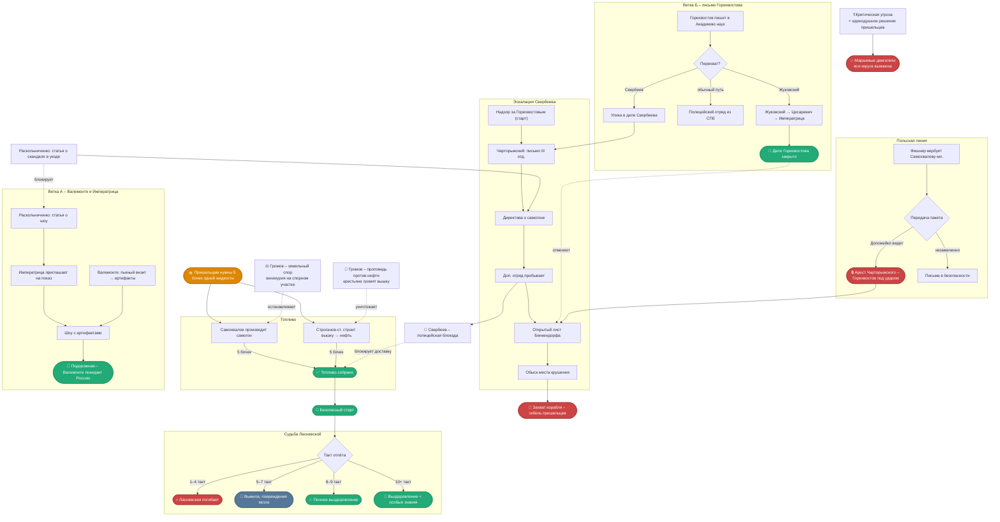
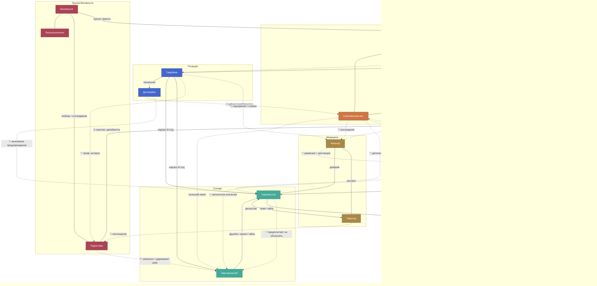

# Динамика игры

Авторский и мастерский разбор того, как может развиваться игра: ветки событий, темп, баланс ресурсов, геометрия конфликтов. Здесь – замысел авторов и инструмент для тонкого направления игры. Строго заданные правила (что мастер делает как обязанность) – в `Механики.md`. Все детали персонажей – в `Персонажи.md`.

**Рекомендуется ознакомиться с разделом «Возможные финалы игры»** в конце файла – он даёт картину того, куда движется игра. Все ветки, конфликты и инструменты мастера в этом файле работают на приближение или отдаление этих исходов.

---

> Насколько сейчас хорошо проработаны связи персонажей? Может, кто-то недозагружен или перегружен?
> Насколько хорошо контролируема динамика игры, исходя из возможных действий персонажей?
> Как тщательно прописанную сюжетную игру не превратить в пьесу? Игрокам нужно достаточно свободы для самовыражения, но хочется реализовать все сюжетные задумки и подтолкнуть игру к положительному исходу. Насколько в нашей игре ты видишь проблему с сюжетными "рельсами", по которым игроки вынуждены катиться?

---

## Карта сюжетных линий



---

## Карта связей персонажей

Сплошные линии – открытые связи; пунктир – скрытые, косвенные или невысказанные. Стрелка указывает направление влияния.



---

## Романтическая карта

Чувства, которые персонажи либо не называют, либо называют неправильно.

| Персонаж | Чувство | К кому | Характер |
|----------|---------|--------|----------|
| Самохвалова-младшая | детское что-то, сама не уверена | Горихвостов | Встречала в детстве, осталось – влюблённость или восхищение, неловко думать |
| Самохвалова-младшая | влечение, называет восхищением | Фишнер | Хочет быть рядом, помогать, стать такой же |
| Самохвалова-младшая | не понимает что именно | Чарторыжский | Мать сватает; дочь влечётся – и не понимает, почему |
| Доложейко | тайная влюблённость | Самохвалова-младшая | Не решается проявить; ревнует к Чарторыжскому |
| Горихвостов | предпочитает не объяснять | Чарторыжский | Знает секрет много лет; что именно чувствует – не спрашивает себя |
| Чарторыжский | предпочитает не задавать вопрос | Горихвостов | Единственный, с кем можно быть собой; что это значит – неизвестно |
| Ефросинья | «любовь духовная», боится признаться | Громов | При нём перехватывает дыхание |
| Громов | необъяснимое расположение | Строганов-старший | Находит благовидные объяснения; думать дальше не намерен |
| Госпожа Самохвалова | светская любезность, не более | Свербеев | Оживлённее, чем с другими гостями – но это просто вежливость |
| Свербеев | «профессиональный интерес» | Ледонтова | Не даёт покоя – ум, достоинство, тёмное прошлое; говорит себе, что это ради служебного расследования |
| Свербеев | отошло в прошлое | Самохвалова-старшая | Думал о ней, что она была бы хорошей мачехой для его детей; но это никак невозможно, да и дети теперь выросли |
| Самохвалов | юношеская влюблённость → шантаж | Ледонтова | В молодости пошёл за ней в кружок; теперь она этим пользуется |
| Ледонтова | любовь или сострадание – сама не знает | Валемонте | Идёт за ним сквозь любые невзгоды |
| Строганов-младший | нежная братская любовь без условий | Строганов-старший | Немного обиженно, немного по-щенячьи |
| Строганов-старший | уважение и что-то ещё | Фишнер | Держится на расстоянии – боится её как строгой учительницы |
| Фишнер | теплота, отдушина | Горихвостов | Понимает её работу и ценит; после крестьянских изб такое общение – роскошь |
| Пирогов | affectus collegialis | Фишнер | Работают вместе давно; стал ближе, чем намеревался |
| Пирогов | эстетическое восхищение | Ледонтова | Яркая натура, затрагивает в нём что-то атрофированное; но всем понятно, что её сердце занято |

---

## Валемонте: артефакты и дуга персонажа

Инопланетяне имеют артефакты, полезные для представлений. Валемонте хочет их получить. Но все, кто приходит на место крушения ночью, теряют память.

### Решение: пьяный визит – см. раздел А «Механика посещения места крушения» в файле Пришельцы.md
- Прийти на место крушения **в состоянии полного беспамятства**
- Пришельцы не занимают волю – нечего занимать (этический принцип)
- Просыпается с фрагментарными воспоминаниями и видит артефакты перед собой, и может общаться с пришельццами и договариваться с ними

---

## Геометрия доступа к контакту: кто, докуда и как быстро

Теоретически почти любой персонаж может дойти до Уровня 3: физический путь через обморок в Волчьем Логе (раздел Б механики посещения в `Пришельцы.md`) открыт всем, а поручение-гейт ограничивает лишь удобный заочный путь к зелёной ленте (раздел А). Поэтому ниже – не теоретический, а **реалистичный** потолок с учётом мотивации, доступа к средству обморока и того, как быстро персонаж вообще узнаёт, что «есть что искать». Сроки – ориентир в тактах (всего их 11); полицейская блокада в финале может заморозить доступ позже.

**Единственное жёсткое отличие по правилам** – старт Горихвостова с синей лентой. Всё прочее регулируется мотивацией, средством обморока и режимом локации, а не персональными запретами.

### Скорость информации по социальным связям

- **Знают, что феномен реален:** Горихвостов (всё), Ефросинья (видела своими глазами), Громов (Ефросинья доложила).
- **Праймлены аномалиями:** Самохвалова-мл. (ленточки на животных + вспышка над поместьем), Пирогов (жалобы пациентов на одержимость; кот с зелёной лентой на старте), Фишнер (через крестьян).
- **Охотятся снаружи:** Валемонте (приехал за «чудом»), Свербеев (следит за Горихвостовым).
- **В неведении / заняты другим:** Самохваловы-старшие, Строгановы, Чарторыжский, Доложейко (пока не послан), Ледонтова и Раскольниченко (пока Валемонте не направит).

Информация течёт быстрее всего по каналам: Ефросинья→Громов (уже произошло), Горихвостов→Фишнер и Горихвостов→Чарторыжский (доверенные), Самохвалова-мл.→Фишнер (тянется к ней), Самохвалов/Громов→Свербеев (как осведомители).

### Авангард (контакт рано и глубоко)

| Персонаж | Потолок | Срок | Чем движется / чем обеспечен |
|---|---|---|---|
| **Горихвостов** | 3 | такт 2–3 | Старт с синей лентой; полная информация; прямой мотив (увести пришельцев безопасно). Нужен лишь диалог «Земное_Существо» + дать питомцу вселиться. Узел всей темы. |
| **Ефросинья** | 1 (до 2-б если опоят) | такт 2–3 | Уже видела место; огород вплотную; начальник (Громов) посылает «ночью». Питомец есть. Совесть гонит разобраться. Глубже – только если кто-то лишит её сознания в Волчьем Логе. |
| **Самохвалова-мл.** | 3 | Ур.1 к 3–4; Ур.3 к 6–8 | Заметила ленточки, романтична, тянется к авантюре и к Фишнер/Горихвостову. Своё ночное действие. Склонна к обморокам и легко достанет алкоголь/лекарство социально – реальный кандидат на глубокий контакт. |

### Середина (зависит от инициативы и кооперации)

| Персонаж | Потолок | Срок | Чем движется / чем обеспечен |
|---|---|---|---|
| **Валемонте** | 3, но цель требует ≥2-б | такт 4–7 | Максимальная мотивация, но низкая стартовая информация *как* попасть. Своё действие даёт лишь Ур.1 (беспамятство – артефакты так не вынести). Обязателен «пьяный визит» (нужен игровой алкоголь от Самохвалова/Строганова-мл.). Скорость = скорость догадки про обморок. |
| **Фишнер** | 3 (латентно) | Ур.1 к 3–5 | Своё ночное действие + сама делает обморочное лекарство (самодостаточна). Но пришельцы для неё периферия (польская линия, медицина) – пойдёт «к соседу» по своим делам. При желании дошла бы до 3 быстро. |
| **Доложейко** | 1 (2-б если опьянеет) | такт 4–6 | Карьерист, рад выслужиться; доходит до Ур.1, если Свербеев пошлёт именно его (со своим питомцем). |
| **Ледонтова / Раскольниченко** | 1 (глубже в связке с Валемонте) | такт 4–7 | Идут по поручению Валемонте. Ледонтова вдобавок с декабристским/контактным бэкграундом и чутьём. |
| **Самохвалов** | 1 (латентно до 3) | когда возьмётся, 3–6 | Своё действие + собственный самогон = технически до 3 тривиально, но мотива нет: он в неведении, идёт «посмотреть у соседа» либо по нажиму Свербеева как осведомитель. Скрытый высокий потенциал при нулевой осознанности. |
| **Громов** | лично 0 (2-б если пойдёт сам) | – / 6–9 | По действию «послать» он диспетчер (отправляет Ефросинью), сам контакта не получает. Личный контакт – только если решит «разобраться через церковь» сам и упадёт без сознания. Информация ранняя, инициатива вероятна, но поздняя. |
| **Пирогов** | 1 → до 3 | Ур.1 на старте; глубже – такт 4–7 | Кот с зелёной лентой на старте (провал памяти тянет к разгадке). Лекарства = самодостаточен для обморока. Нить к Ласневской прописана в карточке. Скепсис – естественный тормоз, но уже надломлен. |

### Периферия (по умолчанию вне контакта)

| Персонаж | Потолок | Срок | Почему |
|---|---|---|---|
| **Свербеев** | лично 0 | – | Максимум следственной мотивации, но действие «послать» – он диспетчер, не ходок. Его роль – гейтить доступ другим (блокада), а не получать контакт. |
| **Строганов-мл.** | 1 | поздно/если возьмётся | Своё действие есть, но мотивация деловая, про пришельцев не знает. |
| **Строганов-ст.** | 0 | поздно/вряд ли | Нет действия, занят нефтью; только физический визит + обморок, без повода. |
| **Госпожа Самохвалова** | 0 | – | Мотив есть (тревога за Наталью, чует неладное), но нет ни действия, ни начальника, ни алиен-картины, а статус хозяйки держит её на раутах. Нужна мастерская зацепка. |
| **Чарторыжский** | 0 | – | Самая низкая мотивация: активно избегает внимания (польские письма, личная тайна). Узнаёт рано от Горихвостова, но к месту не пойдёт. |

### Что важно для мастера

1. **Естественная очередь контакта:** Горихвостов (старт) → Ефросинья (такт 2–3) → Самохвалова-мл. и посланцы (3–4) → Валемонте через «пьяный визит» (4–7). Это органичный темп раскрытия темы.
2. **Узкое место Валемонте:** ключевой по сюжету персонаж упирается в догадку про обморок и в добычу игрового алкоголя. Если к такту ~5 он не нащупал путь – подтолкнуть запиской или через Ледонтову.
3. **Три «ключа» к глубокому контакту** (самодостаточные источники обморока) – Самохвалов (самогон), Фишнер и Пирогов (лекарства). Остальные, кто хочет до 2-б/3, зависят от них социально. Естественный рычаг и для интриги, и для регулировки темпа.
4. **Латентные, но немотивированные:** Самохвалов и Фишнер технически дошли бы до 3 легче всех после Горихвостова, но не имеют повода. Чтобы втянуть их глубже – давать мотив, а не инструмент (инструмент уже есть).
5. **Госпожа Самохвалова** – мотив есть (тревога за Ласневскую, чует неладное), а средств доступа нет. Кандидат на мастерскую зацепку, если её участие в теме желательно.

---

## Сделка Свербеев–Валемонте

### Структура
- **Свербеев нужно:** объяснить странные события начальству, не выглядеть некомпетентным
- **Валемонте нужно:** защита от полиции (на него есть ордер)
- **Обмен:** Валемонте устраивает шоу → Свербеев докладывает «проверено, фокусы»

### Последствия
- Свербеев становится **заинтересован в сохранении тайны** → неожиданный союзник пришельцев
- Если после «закрытия» что-то произойдёт снова – Свербеев выглядит вдвойне плохо
- Сделка **невозможна после публикации статьи** Раскольниченко (версия с фокусами уже не работает)

### Треугольник интересов
```
Свербеев  ←— нужна крышка —→  Валемонте
    ↓                              ↓
  молчит                     нужны артефакты
    ↓                              ↓
Пришельцы ← неожиданно получают время ←┘
```

---

## Моральная дилемма Свербеева

**Главная цель:** не просто «без проблем», а карьера – выделиться, попасть в III отделение.

### Три плохих выбора

| Вариант | Что получает | Что теряет |
|---------|-------------|------------|
| Молчать / принять сделку | Репутация цела | Упущен шанс жизни |
| Доложить правду («пришельцы») | Совесть чиста | Сочтут сумасшедшим, конец карьеры |
| Сфабриковать удобный доклад | Карьерное продвижение | Честность, возможно – невинные пострадают |

**Ключевой соблазн:** те же события можно оформить как реальный заговор – без единого слова о пришельцах:
- Польский шпионаж (Чарторыжский) – UPD: приехал официально к другу Горихвостову, но на самом деле – к сосланным полякам?
- Сеть вокруг опального вольнодумца (Горихвостов)
- Организованная преступность (самогонный завод)

Это коррупция – но «понятная» карьеристу коррупция, без мистики.

---

## Статья Раскольниченко и ветки с Императрицей

У Раскольниченко два разных применения пера – и это разные Поручения, он не может писать обе статьи одновременно.

**Статья о событиях в уезде** (скандал/сенсация) → механика и последствия описаны в `Механики.md`.

**Статья о петербургском шоу Валемонте** (отвлекающий манёвр) → открывает ветку А ниже.

**Гонка:** «скандальная» статья блокирует сделку Свербеева с Валемонте – после публикации версия «просто фокусы» уже не работает. «Рекламная» статья этой сделке не мешает, но требует артефактов.

---

### Ветка А: Шоу в Одессе (спасение Валемонте)

Раскольниченко пишет статью-рекламу о «Небесном театре графа Валемонте» – будто бы со времён петербургских гастролей. Цель: создать образ знаменитости с артефактами из упавшей звезды, а не беглеца от полиции.

**Побочный эффект:** статья доходит до Императрицы Александры Фёдоровны, которая гостит у графа Воронцова в Одессе по пути в Крым. Через секретаря она приглашает Валемонте на частный показ во дворце.

**Что нужно:**
- Артефакты пришельцев – без них шоу не произведёт нужного впечатления
- Статья должна выйти до того, как полиция выследит труппу

**Исход:** Императрица очарована (она обожает всё возвышенное и необычное, воспитана на немецком романтизме). Валемонте просит защиты – «грубые ищейки» преследуют его за открытие небесного чуда. Императрица выдаёт особую подорожную грамоту от своей личной канцелярии. Валемонте, Ледонтова и Раскольниченко покидают Россию через Одесский порт – полиция с ордерами остаётся на причале.

**Цена:** один артефакт – как прощальный подарок Императрице после шоу.

---

### Ветка Б: Жуковский и Цесаревич (спасение Горихвостова)

Горихвостов пишет письмо в Академию наук (его Поручение). Письмо – случайно или через связи – попадает к В. А. Жуковскому: поэту-романтику, наставнику Цесаревича, давнему защитнику опальных. Жуковский склонен видеть в необъяснимом «небесное знамение», а не политическую угрозу.

Жуковский тайно показывает артефакт 17-летнему Цесаревичу Александру. Тот заворожён. Вместе они решают показать вещь Императрице – как «небесное чудо», а не улику. Николай I, узнав от жены, лично осматривает артефакт и забирает его – но отношение к Горихвостову меняется: из «государственного преступника» он становится «поставщиком царских редкостей».

**Исход:** Губернатор присылает Свербееву предписание – прекратить все действия против Горихвостова, артефакты отправить в Петербург. Свербеев оказывается в ситуации, где дело, которое он вёл, ушло «поверх его головы».

**Цена:** Горихвостов лишается всех артефактов. Но остаётся свободным – и, возможно, с монаршим перстнем за преданность.

**Ключевой риск:** если Свербеев перехватит письмо до того, как оно достигнет Жуковского – ветка закрыта. Это создаёт гонку: Горихвостов должен успеть раньше, чем Свербеев накопит достаточно оснований для перехвата.

---

### Пересечение веток

Обе ветки приводят к артефактам у Романовых.
Всего артефактов, которые пришельцы готовы отдать, три. По минимуму Горихвостову нужен 1 (для Жуковского), Валемонте нужен 1 (для шоу и в подарок Императрице).
Но и Горихвостову и Валемонте хочется иметь больше одного: большее количество сделает их более убедительными в отстаивании своего спасения перед августейшими особами.

При правильном понимании ситуации оба персонажа заинтересованы в **кооперации**, а не конкуренции. Конфликт возникает только из-за непрозрачности: Горихвостов может не знать про ветку А, Валемонте – про ветку Б.
Пришельцы, контролируя доступ к артефактам, оказываются арбитрами распределения – и могут использовать это как рычаг в переговорах с обоими. Инопланетяне не понимают человеческих интриг и сути проблемы, но возможно этот кейс будет для них интересным исследованием человеческого общества.

---

## Земельный спор: механика и наблюдательный пункт

### Почему Самохвалов не может отдать участок Громову

Упрямства характера недостаточно как игровой механики. Решение: **винокурня стоит на спорном участке** (сам котёл, колодец, амбар с зерном – физически там). Отдать землю = ликвидировать производство = нет самогона = нет топлива для пришельцев.

### Парадокс Громова

Громов требует землю, угрожая донести о самогоне. Но если он получит землю – рычаг исчезнет вместе с заводом. Его оптимальная стратегия – **бесконечно угрожать, не получая участка**. Это красивый момент, который игрок-Громов может открыть сам в ходе игры.

### Наблюдательный пункт

Трудники работают на спорном участке. Громов посылает Ефросинью их контролировать. С этого участка **виден двор Горихвостова** (место крушения).

Ефросинья уже побывала там и вернулась смущённой – видела что-то необъяснимое. Громов велел молчать, истолковав как бесовщину. Он хочет разобраться сам через церковь, до того как светская власть возьмёт это в свои руки.

Самохвалов при этом не знает ни про пришельцев, ни про то, что его участок – стратегическая точка наблюдения. Его упрямство имеет непредвиденные последствия, о которых он даже не подозревает.

---

## Свербеев как вербовщик: Самохвалов, не Громов

### Почему Громов – плохой осведомитель

Громов непредсказуем: когда разговор касается нечистой силы, знамений, странностей у Горихвостова – он может начать проповедовать и рассказать то, о чём надо молчать. Не из злого умысла, а из пастырского долга. Такой источник ненадёжен.

### Самохвалов – вынужденный осведомитель

**Рычаг:** незаконное производство самогона в промышленных масштабах.  
**Доступ:** рауты происходят у него дома – лучшая позиция для наблюдения.  
**Мотив к сотрудничеству:** либо арест, либо закрываю глаза в обмен на информацию о Горихвостове.

### Конфликт интересов Самохвалова (он сам не осознаёт)

Самохвалов хочет, чтобы Горихвостов получил достаточно самогона (пришельцы улетят). Одновременно он сливает Свербееву наблюдения за Горихвостовым. Оба действия продиктованы самосохранением – и работают друг против друга. Самохвалов не знает про пришельцев, поэтому доносит невинные детали, которые Свербеев складывает в нужную ему картину.

### Громов: нечаянный источник утечки

Громов не осведомитель, но опасен иначе. **Механика:** когда в разговоре всплывают определённые темы (бесовщина, странности у Горихвостова, знамения), ему трудно молчать. В загрузе это внутренняя борьба: пастырский долг требует предупреждать, а осторожность – молчать. В нужный момент он может произнести проповедь, после которой все в комнате узнают что-то лишнее.

### Фрагменты для загрузов

**Ефросинья:** видела что-то у Горихвостова, описывает своим языком (без слова «пришельцы»). Громов велел молчать. Ей неспокойно: молчать = покрывать нечистое, ослушаться = грех. Стартовый вопрос – поговорить с Громовым снова.

**Громов:** Ефросинья рассказала. Он ещё не решил, что делать. Свербеев на прошлом рауте намекнул, что нужны глаза на Горихвостова – у Громова есть такая позиция. Стартовый вопрос: можно ли доверять Свербееву.

**Свербеев:** знает или догадывается, что с участка Самохвалова виден двор Горихвостова. У Громова там работает монахиня. Есть два варианта получить наблюдения: через Громова (ненадёжно) или завербовать самого Самохвалова (есть чем давить).

---

## Польская линия: Фишнер, Самохвалова-младшая, Чарторыжский

### Цепочка

Фишнер получает мастерскую записку в начале игры: найти на рауте надёжную женщину, которая согласится принять от майора Чарторыжского небольшой пакет и хранить его до востребования – без имён, без объяснений. Кого выбрать – её решение и её ответственность.

Самохвалова-младшая – очевидный выбор: тянется к Фишнер, романтична, готова на авантюру. Но она не знает, что происходит: просто инструкция «если майор предложит уединиться – согласиться и принять пакет».

Передача происходит, когда Самохвалова подходит к Чарторыжскому и называет условленное слово. Оба не знают друг друга заранее. Чарторыжский не знает, что в письмах. Самохвалова не знает, от кого они.

### Ревность как угроза

Доложейко следит за Самохваловой из личных побуждений – и может оказаться рядом именно в момент передачи. Ревность и карьеризм здесь работают в одном направлении: если донести о передаче, это и уберёт соперника, и выслужит перед начальником.

| Сценарий | Исход |
|----------|-------|
| Передача прошла незамеченной | Письма у Самохваловой; дальнейшая судьба на усмотрение мастера |
| Доложейко замечает | Улика против обоих; Горихвостов как хозяин дома автоматически под подозрением |
| Свербеев обыскивает Чарторыжского до передачи | Письма найдены; военный суд, конец карьеры офицера |
| Фишнер не нашла получательницу вовремя | Письма зависают у Чарторыжского – нарастающий риск с каждым тактом |
| Ледонтова случайно оказывается рядом | Узнаёт знакомое лицо или слышит нужное слово; старая солидарность может взять своё |

### Пересечение с другими линиями

Если Доложейко доносит – Свербеев получает готовое дело о заговоре без всяких пришельцев: польский офицер с крамольными материалами у опального вольнодумца. Это усиливает его позиции для эскалации и даёт ему повод запросить открытый лист раньше.

Если передача прошла тихо – письма лежат у Самохваловой, которая не понимает их значения. Мастер может разыграть это в финале: что она с ними сделает, если узнает правду?

---

## Финальная эскалация Свербеева

Свербеев движется по нарастающей: первые такты он почти бессилен, к концу игры – реально опасен. Мастеру важно понимать фазы и знать, в какой момент давать следующий инструмент.

### Фазы

| Фаза | Триггер | Что получает Свербеев |
|------|---------|----------------------|
| Старт | Рутинное предписание III отделения | Формальное основание следить за Горихвостовым |
| 1–2 такт | Появление Чарторыжского | Письмо напрямую из III отделения – сигнал, что дело важнее рутины; туманное «усердие не останется без внимания» |
| 3–5 такт | По усмотрению мастера | Директива о самогоноварении – первый публичный инструмент давления |
| Середина | По запросу Свербеева (если есть обоснование) | Дополнительный полицейский отряд через 1–2 такта |
| Кульминация | По усмотрению мастера | Прикомандирование к Корпусу жандармов + **открытый лист за подписью Бенкендорфа** |

### Дополнительный полицейский отряд

Позволит блокировать доступ в локацию крушения корабля.

### Открытый лист – переломный момент

После его получения Свербеев может требовать содействия от кого угодно, включая армейских офицеров. Чарторыжский теряет защиту мундира. Горихвостов не может апеллировать к губернской цепочке. Это прямая коллизия с веткой Б: если губернатор одновременно прислал предписание прекратить дело Горихвостова – два документа противоречат друг другу, и ситуация становится неопределённой даже для самого Свербеева.

При наличии усиленного наряда **и** прикомандировании к Корпусу жандармов Свербеев может отдать поручение на усиленный обыск локации с правом применять силу. Это приведёт к обнаружению корабля пришельцев и возможно его конфискации (он не очень большой), с возможной гибелью пришельцев в процессе или впоследствии.

**Для мастера:** открытый лист – кнопка финала. Давать его стоит когда: пришельцы ещё не улетели, у Свербеева накоплено достаточно оснований, ни ветка А ни ветка Б не закрыты. Он создаёт давление на всех одновременно и требует быстрых решений.

---

## Маршевые двигатели: крайний сценарий пришельцев

### Условие и механизм

Инициируется совместным решением всех игроков-инопланетян – только так, не единолично. Условие: угроза немедленного захвата корабля, или коллективное решение что людей беречь больше нет смысла.

**Последствие:** взрыв при старте. Вся округа в радиусе нескольких километров выжжена, люди в окрестностях погибают. Пришельцы улетают. Наталья Ласневская – в радиусе поражения.

### Почему пришельцы этого избегают

- Этический принцип: причинять вред разумным существам для них недопустимо по природе.
- Ласневская она пострадала по их вине, они несут за неё ответственность, поэтому улетать даже безопасным способом до того, как она полностью вылечится, для них недопустимо.

### Роль для мастера

Маршевые двигатели – не просто «плохой исход», а инструмент напряжения. Игроки-инопланетяне знают об этой опции с самого начала. Это создаёт у них ощущение, что выход всегда есть – но воспользоваться им невозможно без моральной катастрофы.

Мастер может напомнить об этой опции если игра заходит в тупик и пришельцы теряют инициативу. Само упоминание этой возможности – давление на людей, которые об этом узнают.

**Когда сценарий становится вероятным:** Свербеев получил открытый лист и ведёт отряд к месту крушения; все пути к топливу заблокированы; пришельцы решили, что ждать больше нельзя.

---

## Экономика: финансы, самогон, нефть

### Финансовые позиции на старте

| Персонаж | Деньги | Характер |
|----------|--------|---------|
| Самохвалов | 2000 | Весь свободный капитал; всё остальное вложено в имение |
| Горихвостов | +1000 в такт | Единственный регулярный доход остающийся после трат на жизнь и хозяйство |
| Чарторыжский | 2000 | Дорожные деньги; разовый источник |
| Строганов-старший | 0 свободных | Все деньги вложены в артели; хочет добывать нефть, но не на что |
| Остальные | – | Финансово пассивны |

Горихвостов – единственный, кто получает деньги каждый такт. Это делает его ключевым финансовым посредником, даже если он сам об этом не думает.

---

### Путь 1: самогон

**Цель:** 5 бочек × 1000 вложений = 5000 суммарных затрат Самохвалова. Минимум 6 тактов.

**Оптимальный сценарий** (Самохвалов производит сразу, Горихвостов покупает у Самохвалова с минимальной наценкой за счёт Чарторыжского):

В первый такт Самохвалов производит 1 бочку из своего капитала.
Во второй такт Горихвостов покупает 1 бочку у Самохвалова, наценку может давать 1000 из своих сбережений и возможно заняв 2000 у Чарторыжского (наценку распределить на 5 бочек). Самохвалов производит ещё бочку из выручки.
И так далее, итого: 5 бочек к такту 6. Стоимость: 6000 дохода Горихвостова + максимум 2000 Чарторыжского = 8000 (до 1600 за бочку, или больше, если медленнее, копя доход Горихвостова).

**Сценарий без кооперации (полная цена):** Горихвостов способен оплатить всё сам из регулярного дохода – вопрос только цены. По стандартной рыночной цене Строганова-младшего (2000 за бочку, 100% наценки) 5 бочек стоят 10000 = 10 тактов дохода – финал впритык к концу игры. Каждые 200 наценки сверх себестоимости – примерно +1 такт к сроку готовности. Заём 2000 у Чарторыжского сокращает срок на 2 такта. Цена бочки – фактически слайдер «доверие ↔ время».

**Проблемы:**
1. Самохвалов может не хотеть производить, боясь полиции и недовольства жены. Особенно на свои деньги (на 1 такте). Особенно после директивы о борьбе с самогоноварением. Может быть, ему удастся договориться со Свербеевым.
2. Самохвалов может не хотеть продавать Горихвостову из общей антипатии к неблагонадёжному и странному соседу.
3. Самохвалов может не хотеть продавать Горихвостову с той наценкой, которую он предлагает, если договорится со Строгановым-младшим делить доход в более выгодной для него пропорции (с бочки 1000 прибыли на двоих).
4. Чарторыжский скорее всего захочет помочь другу, но у него могут быть форс-мажорные обстоятельства, и он не сможет дать денег.

### Путь 2: нефть

**Цель:** 2000 на вышку + 5 × 1000 на добычу = 7000 суммарных затрат Строганова-старшего. Минимум 7 тактов.

**Проблема:** у Строганова-старшего нет свободных денег. Он хочет добывать нефть – но только если это выгодный бизнес, а не благотворительность.

**Возможные источники финансирования:**
- Горихвостов один: 2000 на вышку (2 такта дохода) + 1 такт на строительство + 5 тактов на бочки = 8 тактов
- Горихвостов + Чарторыжский: 2000 сразу + 1000/такт → вышка готова на 2 такте, у Горихвостова накоплено 2000 на наценку или возврат долга;
 начиная с 3 такта Горихвостов из текущих доходов покупает по 1 бочке → 5 бочек к такту 7.
- Сделка «вышки вместо наценки»: Горихвостов оплачивает по себестоимости 2 вышки (4000) и добычу бочек (по 1000); прибыль Строганова-старшего – обе вышки, которые остаются ему после отлёта. За 6 тактов строятся 2 вышки, ещё за 3 такта добываются бочки → 5 бочек к такту 9 ровно на чистом доходе (4000 + 5000 = 9000); шестая бочка или ускорение на 1–2 такта – с деньгами Чарторыжского.

**Бизнес-логика Строганова:** Если Горихвостов вкладывается в вышку как инвестор, Строганов добывает – и делит прибыль. Это честная сделка в духе артельного дела. Пришельцы получают бочки, Строганов получает рабочую вышку, которую потом можно использовать дальше. Мотивация не требует раскрытия тайны об инопланетянах.

**Уязвимость:** проповедь Громова против «адской подземной жидкости» может уничтожить вышку. Всё вложенное сгорит за один такт.

---

### Сравнение путей

| Параметр | Самогон | Нефть |
|----------|---------|-------|
| Общие вложения | 5000 | 7000 |
| Минимум тактов | 6 | 7 |
| Кто производит | Самохвалов | Строганов-старший |
| Риск блокировки | Свербеев, Громов, жена | Громов (народные волнения) |
| Кто финансирует | Самохвалов + Горихвостов + Чарторыжский | Горихвостов + Чарторыжский |

**Пути не суммируются:** пришельцам нужны 5 бочек одной и той же жидкости.

Самогонный путь быстрее и дешевле по себестоимости (но есть шанс договориться на меньшую наценку, так как Строганову останется вышка) – но уязвимее социально.
Нефтяной – чуть медленнее, требует больше денег и кооперации, но не тянет за собой шантаж и доносы, возможны только проблемы с Громовым.

---

### Экономические узлы давления

**Громов и земельный спор:** винокурня стоит на спорном участке. Если Самохвалов отдаёт землю – производство останавливается физически. Громов, требуя землю, экономически блокирует самогонный путь для пришельцев, сам того не зная.

**Свербеев и самогон:** угроза ареста заставляет Самохвалова работать на Свербеева. Но если производство остановить – рычага больше нет. Свербееву выгодно, чтобы самогон лился, а не чтобы завод закрыли.

**Строганов-младший как развилка:** он продаёт самогон. Если бочки нужны пришельцам – он должен *не продавать*, хотя продажа приносит деньги. Это его личная дилемма: лояльность брату (и деловая логика) против чего угодно другого.

---

## Возможные финалы игры

### Исходы для пришельцев

| Исход | Условие | Примечание |
|-------|---------|------------|
| Улетели на самогоне | 5 бочек самогона | ограничен давлением на Самохвалова |
| Улетели на нефти | 5 бочек нефти | ограничен благосклонностью Громова |
| Маршевые двигатели | Критическая ситуация | Крайний выход; пришельцы избегают – вся округа выжжена, люди в нескольких километрах погибнут |
| Захват и вывоз в СПб | Тайная Канцелярия организует экстрадицию | Вероятная гибель пришельцев |

**Маршевые двигатели** – аварийный режим, инициируется решением совместного сбора всех игроков-инопланетян (например, при угрозе захвата корабля). Подробнее – в разделе «Маршевые двигатели» выше.

### Судьба артефактов

- остаются у инопланетян
- попадают к Валемонте – для шоу и как прощальный подарок Императрице (ветка А)
- попадают к Горихвостову – через Жуковского к Цесаревичу и Императрице (ветка Б)
- попадают в жандармерию и покрываются пылью в архиве

### Личные исходы для персонажей под угрозой преследования

| Персонаж | Угроза | Ключевое условие спасения | Исход при провале |
|----------|--------|--------------------------|-------------------|
| Валемонте, Ледонтова, Раскольниченко | В бегах, ордер на арест | Ветка А: статья о шоу + артефакты + Императрица в Одессе | Арест, возврат на суд по месту преступлений |
| Горихвостов | Надзор III отделения, улики копятся | Ветка Б: письмо → Жуковский → Цесаревич → Императрица | Ссылка или заключение |
| Чарторыжский | Польские письма при себе; наблюдение III отделения | Передать письма до обыска; не раскрыть личную тайну | Военный суд; конец службы и свободы |
| Самохвалова-младшая | Соучастие в польской переписке (если Фишнер вербует её курьером) | Передача прошла незамеченной | Арест как соучастница; Горихвостов автоматически под подозрением как хозяин дома |
| Фишнер | Подпольная деятельность, связь с польской сетью | Не быть опознанной при расследовании польского дела | Арест, ссылка |
| Самохвалов | Нелегальное производство самогона | Договориться со Свербеевым или остановить производство | Реквизиция оборудования, штраф; при упорстве – арест |

Подробнее о ветках А и Б – в разделе «Статья Раскольниченко и ветки с Императрицей».

---

## Судьба Натальи Ласневской

Исход зависит от такта, в котором пришельцы улетают. Чем дольше они её лечат, тем больше она восстанавливается. Подробнее - см. карточку "Эволюция Ласневской" в `Пришельцы.md`.

До отлёта Наталья находится в коме на месте крушения; после – Пирогов осматривает её, и история так или иначе выходит наружу.

Благополучие Натальи – один из аргументов пришельцев при выборе времени и способа отлёта. Горихвостов знает об этой зависимости и несёт её как личную ответственность.

---

