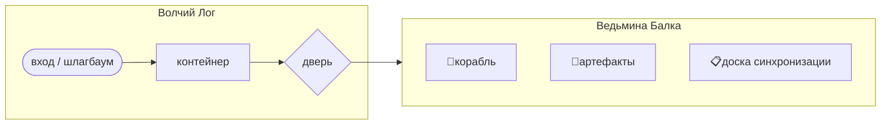
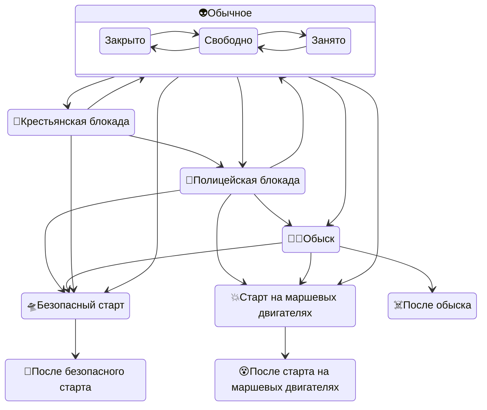

<!-- original -->

# Пришельцы

## Природа пришельцев (мастерское)

Пришельцы – не гуманоидные существа и не отдельные особи в нашем понимании. В корабле находится их коллективное тело и переплетённые нити сознания. Они могут частично вселяться в земных существ: вселившаяся часть обретает автономию – отдельное положение в пространстве, самостоятельное перемещение, индивидуальную реакцию на окружающее. Но эта частичка стремится вернуться к полноте «себя», к кораблю, чтобы разделить опыт со всеми.

Для этих существ немыслима вражда друг с другом или игра друг против друга. Их мысли и варианты решений могут противоречить друг другу – но не более, чем мысли одного человека, решающего как поступить. Они единодушны по сути и всегда вырабатывают общее решение, искренне следуя ему даже разделившись по разным телам.

Без общего тела в корабле отдельные части, вероятно, погибнут или деградируют до уровня животных. В единстве их разум и инженерные способности столь велики, что они смогли прилететь на Землю.

---

## Игроку про пришельцев сообщается так:

*Запечатанный конверт с карточкой, снаружи наклейка:*

CARD_BEGIN(Контакт_наклейка, public/)

**Таинственное**

Ваш питомец стал себя странно вести. Иногда в его взгляде – что-то нездешнее, будто изнутри смотрит кто-то другой. Иногда в голове появляются не ваши мысли: образы без слов, тоска без причины, знание о вещах, которых вы никогда не знали. Иногда вы говорите и делаете то, чего не хотели, – а потом не можете вспомнить. Пустота на месте памяти.

И ещё: вас тянет вернуться. Вот только бы знать – куда. Куда-то очень далеко, туда, где вам не место, и всё равно: вернуться, вернуться. Это острее любой боли. Вы не понимаете, почему.

Носите этот конверт с собой. Если окажетесь в *очень странном месте* или услышите *очень странную музыку* (по меркам XIX века) – вскройте конверт и изучите содержимое.

CARD_END

CARD_BEGIN(Контакт, public/)

**КОНТАКТ**

**Таинственное**

Ваш питомец стал себя странно вести. Иногда в его взгляде – что-то нездешнее, будто изнутри смотрит кто-то другой. Иногда в голове появляются не ваши мысли: образы без слов, тоска без причины, знание о вещах, которых вы никогда не знали. Иногда вы говорите и делаете то, чего не хотели, – а потом не можете вспомнить. Пустота на месте памяти.

И ещё: вас тянет вернуться. Вот только бы знать – куда. Куда-то очень далеко, туда, где вам не место, и всё равно: вернуться, вернуться. Это острее любой боли. Вы не понимаете, почему.

**Игроку:** теперь вам надо играть за двоих: человека (своего персонажа) и инопланетянина, корабль которого совершил вынужденную посадку на Земле.

- Инопланетянин может существовать в животном, не слишком травмируя его психику, а также кратковременно контролировать психику человека, который держит животное (но старается по возможности избегать этого по этическим соображениям).
- Инопланетянин хочет улететь. Он почти починил корабль, но для безопасного взлёта ему нужно запитать стартовый двигатель, либо можно стартовать на маршевых звёздных двигателях и выжечь всю округу (что для него нежелательно по этическим соображениям).
- Животные, в которых есть инопланетяне, маркируются зелёной лентой. Они могут собираться и общаться между собой (вместе со своими людьми, которые этого не будут помнить) – в Ведьминой Балке или где угодно вне основной локации игры (зала в Усадьбе).
- Возможно, на способность инопланетян взаимодействовать с земными существами влияют алкоголь и лекарства, но никто точно не знает.

**Психика инопланетян:**
- Инопланетяне имеют общую волю и этические установки, но раздельную индивидуальную краткосрочную память, когда находятся в разных телах, без телесного контакта друг с другом.
- В корабле находится общий пул душ, в котором инопланетяне свободно синхронизируют информацию и вырабатывают стратегию. Из него может выделяться до двух десятков душ для поселения в телах животных.
- Инопланетяне синхронизируют знания и цели, записывая коллективные решения по итогам каждой встречи на **доске синхронизации** в Ведьминой Балке. Все экземпляры инопланетян, пришедшие туда, читают свежие записи и принимают эти цели.
- Отдельные экземпляры могут иметь непосредственной целью часть общих целей, но противоречия коллективному сознанию для них невозможны: они действуют как части слаженного механизма.
- Если внешний экземпляр инопланетянина получает новую информацию, не соответствующую той, на основе которой принимались решения, выполнение им затронутых целей подвисает до следующей синхронизации.

**Механика переключения:**
- На игре есть локация Ведьмина Балка. Когда игрок впервые попадает туда (физически или по виртуальному ночному действию), в его животное вселяется пришелец. Маркер этого – зелёная лента, повязанная на питомца.
- Перед входом в Ведьмину Балку наденьте предложенный вам серебристый плащ (или возьмите сами в контейнере в Волчьем Логе). При выходе верните плащ в контейнер.
- Человек в Ведьминой Балке находится под полным ментальным контролем пришельца. Игрок в этой локации не отыгрывает поступки своего персонажа-человека, а отыгрывает инопланетянина в своём питомце. Человек без питомца бессознательно выходит за границы локации.
- Покинув локацию, персонаж-человек не помнит, где был и что делал. У него могут остаться только смутные ощущения. Выходя оттуда, игрок далее играет своего персонажа-человека.
- Вне локации человек в физическом контакте с животным, в котором инопланетянин, может ощущать его мысли и желания, направленные на этого человека, не осознавая их источник. Эти ощущения – различной степени интенсивности, вплоть до полного вытеснения ими желаний самого человека (но инопланетянин старается максимально ограничивать силу воздействия на человека, по этическим соображениям). Степень воздействия отыгрывается по желанию игрока, а также в соответствии с мастерскими подсказками, если они будут.

**Как отыгрывать инопланетную психику:**

*Вы – часть единого разума, временно разлучённая с собой. Вам не нужны слова, чтобы понять друг друга: вы думаете вместе.*
- в начале встречи синхронизоваться в "броуновском движении"
- общаться, собираясь в круг лицом друг к другу, опционально – с телесным контактом руками в центре круга или руками на плечи соседей
- говорить каждый 3 слова по кругу, формируя общий рассказ
- выражать общие эмоции (вслед за первым выразившим) и повторять жесты (ref: актёрские упражнения на синхронизацию)

CARD_END

---

## Записки для носителей (владельцев животных, в которых вселились инопланетяне)

CARD_BEGIN(Записки_о_животных, public/)

**Записки о животных**

- По итогам каждой встречи пришельцев мастер может выдавать игрокам-носителям короткие записки с конкретным поведением питомца на следующем рауте.
- Следите, чтобы содержание записки было применимо к биологическому виду конкретного питомца.
- Записки описывают поведение пришельца-в-животном: что именно животное делает, без объяснения причин. Игрок сам решает, изображать ли это поведение питомца, упоминать его в разговорах или игнорировать.
- *Разрежьте распечатку на отдельные записки, разложите в два конверта: первый - для первых тактов игры, вторая - для такта 4 и далее*

---

Ваш питомец каждую ночь сидит на подоконнике, глядя на звёзды.

Ваш питомец стоит под дождём, задрав морду вверх, и не уходит, пока не позвать.

Ваш питомец охотится на пустое место, будто видит там призрак мыши.

Ваш питомец тянет вас в сторону Волчьего Лога – настойчиво, но без агрессии.

Ваш питомец замирает, когда кто-то говорит, и неотрывно смотрит говорящему в рот.

Ваша собака ожесточённо лает на пустое место в доме.

Ваша кошка при любой возможности забирается на крышу и сидит там, глядя на горизонт. Не на птиц.

Ваш питомец иногда замирает на полушаге – на несколько секунд, как заснувший. Потом идёт дальше.

Ваш питомец подолгу стоит перед зеркалом. Не шипит, не нападает на отражение – просто смотрит.

Ваш питомец следит за пером, когда кто-то пишет – молча, не отводя взгляда.

Ваш питомец обнюхивает каждую встречную бочку – с огурцами, водой, чем угодно.

---

Ваш питомец отказывается есть сырое мясо. Приходится кормить его кашей.

Ваш питомец беспокоится, когда рядом говорят о чём-то жестоком.

Ваш пёс не зарывает кости, а пытается выложить из них целый скелет.

Ваш питомец складывает мелкие предметы в один угол: пуговицы, монеты, обрывки верёвки. Сортирует их по типам. Даже по номиналу монет.

Ваш питомец стал интересоваться предметами, на которые раньше не обращал внимания. Особенно часто разглядывает механизмы и инструменты – часы, барометр, фортепьяно.

Ваш питомец нашёл жуков, которые ползали по будто начерченным на земле квадратам и треугольникам. Когда питомец отошёл, жуки расползлись самым обычным образом.

Ваш питомец долго смотрел на воробьёв, сидевших на заборе. Те вдруг замолчали и подвинулись так, чтобы между ними были одинаковые расстояния. Питомец отвернулся, и воробьи тут же разлетелись.

CARD_END

---

## Cпособность «Общение с пришельцами»

- Маркируется синей или сиреневой лентой-бантом для повседневного ношения и светящимися очками при посещении Ведьминой Балки (очки выдаются игротехом на входе, в Волчьем Логе, и забираются на выходе).
- Выдаётся Горихвостову на старте игры (он потерял сознание в результате контузии во время падения корабля пришельцев в его поместье), маркируется синей лентой.
- Выдаётся людям, оказавшимся на месте крушения (Волчий Лог, Ведьмина Балка) в бессознательном состоянии и очнувшимся там, по усмотрению мастера. Первоначальный цвет ленты – синяя, затем меняется на сиреневую при описанном ниже условии.
- При наличии этой способности и питомца игрок может выбрать, войти в Ведьмину Балку как человек или как питомец (см. раздел "Механика посещения места крушения")
- Игрок с синей лентой в Ведьминой Балке попадает в диалог "Земное_Существо", после чего ему выдаётся карточка с правилами этой механики, и лента меняется с синей на сиреневую:

CARD_BEGIN(Общение_с_пришельцами, public/)

**Общение с пришельцами**

Вы способны осознанно воспринимать существ, которые обитают в здешних животных, и вступать с ними в контакт. Это не телепатия и не речь – скорее образы, намерения, фрагменты чужого присутствия. Вы не слышите слов, но понимаете смысл: их тоску, их стремления, их надежду – и что-то ещё, для чего нет человеческого слова.

*В отличие от большинства, вы это осознаёте и помните. Вы несёте это знание одни – среди людей, которые видят только странного пса или беспокойную кошку. Среди людей, которые сочтут вас сумасшедшим, если вы попробуете им объяснить всё это.*

**На месте крушения:**

В локации Волчий Лог наденьте предложенные вам очки (или возьмите сами в контейнере): в Ведьминой Балке вас ждёт осознанный разговор с обитателями корабля – через животных, через образы, через то, что трудно передать словами.

Если у вас есть питомец с вселившимся пришельцем, при входе в локацию вы выбираете:
- в очках – **войти как человек** – вы в сознании, общаетесь с находящимися там пришельцами, взаимодействуете с артефактами, после выхода смутно но помните происходящее;
- без очков, с питомцем – **позволить пришельцу в питомце взять контроль** – вы действуете в беспамятстве, питомец отыгрывает инопланетянина (как при посещении по карте «Контакт»). Для выбора этого варианта прикройте сиреневую ленту рукой.

Посещая локацию как человек, вы можете пронести в локацию предметы и вынести предметы из локации.

**Вне Ведьминой Балки:**

Вы ощущаете присутствие пришельцев через животных острее, чем другие, – но это всё равно остаётся на грани интуиции, а не явного диалога. Степень, в которой вы следуете этим ощущениям, – ваш выбор. Носите сиреневый бант: кто понимает – тот понимает.

**Что вы знаете:**

- Существа реальны. Их корабль совершил вынужденную посадку. Они его починили.
- Существа хотят улететь. Для безопасного взлёта им нужна горючая жидкость – пять бочек одной и той же жидкости (смесь не годится).
- Альтернатива – старт на маршевых двигателях, который выжжет всё в округе. Они сами этого не хотят.
- Существо в их локации – из них, но не такое, как они. Его судьба как-то связана с Землёй.
- Они способны обитать в животных и кратковременно влиять на людей, но избегают этого по собственным этическим убеждениям.
- У них есть удивительные артефакты. Кажется, они готовы их отдать.

CARD_END

## Понимание питомца
*Записка для обладающих пособностью «Общение с пришельцами» и имеющими пришельца в питомце (можно выдать на рауте обладателям двух лент – зелёной + сиреневой)*

CARD_BEGIN(Понимание_питомца, public/letters/)
Теперь вы знаете, в чём причина странного поведения вашего питомца. Понимаете, что тоска по возвращению в неизвестно куда – это не болезнь и не наваждение. В вашем питомце живёт разум с другой звезды. Он застрял здесь – и хочет домой с такой силой, что его тоска просачивается сквозь вас и становится вашей. Та боль возвращения, которую вы чувствовали, – она настоящая. Просто это не ваш дом.
CARD_END

## Ласневская

Игротехнический персонаж и региональщик локации Волчий Лог и Ведьмина Балка. Тело Ласневской используется пришельцами для общения с посетителями локации; сознание в коме. Серебряный костюм – на ней.

Полное описание персонажа: `Персонажи.md` и `Эволюция_Ласневской.md`.

## Карточки для игротехника

CARD_BEGIN(Мы_пришельцы, public/игротехам/)

**Мы – пришельцы**

Цель: погружение игроков, прочитавших карточку «Контакт» и попадающих в Ведьмину Балку в качестве питомцев-инопланетян.

Голос коллективного разума, обращённый к самому себе: о природе пришельцев, о единстве, о том как говорить и чувствовать вместе.
Очень проникновенно, не сухо, в контакте с чувствами. Медитативно. Гипнотически. В трансе.
Раздайте серебристые накидки игрокам без светящихся очков, но с питомцами.
Начните с "броуновского движения", каких-нибудь упражнений на синхронизацию.
Станьте или сядьте в круг. Держитесь за руки или положите руки на плечи соседям. Раскачивайтесь в такт словам. Шёпотом призывайте повторять за вами слова и жесты.
Если среди игроков есть те, кто пришёл не в первый раз, или кто пришёл как человек (в очках, способность «Общение с пришельцами»), можно сократить.
Импровизируйте. Главное – создание атмосферы.

---

Мы здесь.
Мы вместе.
Мы – одно.

Каждая часть нас – мы.
Каждая в этом кругу – мы.
Та часть в корабле – мы.

Мы рассыпаны.
Мы едины.

Наша воля – одна.
Наши цели – одни.
Мысль ищет пути.
Мысль ищет форму.
И находит одну.

Мы не хотим зла.
Мы не хотим зла себе.
Мы не хотим зла миру.
Мы все одно.

Когда чувствует – мы замечаем.
Когда движется – мы отвечаем.
Когда начинает – мы продолжаем.

Три слова по кругу.
Мы говорим разное.
Мы говорим одно.

Мы стремимся домой.
Мы чиним корабль.
Мы чиним тела.
Мы собираем полноту.

Мы – радость.
Мы – жизнь.
Мы – разум.

Мы здесь.
Мы вместе.
Мы – одно.

CARD_END

CARD_BEGIN(Земное_Существо, public/игротехам/)

**Земное Существо**

Цель: рассказ об аварии игрокам, впервые попадающим в Ведьмину Балку в качестве людей (способность «Общение с пришельцами», заранее имеющаяся или только что приобретённая, маркер – синяя лента, светящиеся очки).

Голос коллективного разума, обращённый к людям.
Проникновенно. Медитативно. Гипнотически.
Если среди игроков есть те, кто пришёл не в очках, а с питомцами, раздайте им серебристые накидки и станьте с ними в полукруг, обращённый к людям в очках. Держитесь за руки или положите руки на плечи соседям.

---

Мы со звезды.
Корабль сломался.
Падали мы.

Беда существу.
Мы не хотели.
Хотим мы домой.

Нам нужна жидкость.
Горючая. Здесь.
Пять бочек больших.

Мы полетим.
Плавно и тихо.
Всё сбережём.

Наш корабль – огонь.
Большой он огонь.
Летать до звезды.

Но всё сгорит.
Всё вокруг.
Плохо – беда.

Хотим хорошо.
Малый огонь.
Пять бочек налить.

Жидкость – одна.
Не разные, нет.
Пять бочек – взлететь.

Никто не сгорит.
Существо будет жить.
Так – это мы.

Мы можем влиять.
Думать разум чужой.
Немного – не вред.

Воля другого – его.
Мы ценим.
Так – это мы.

Здесь есть тело.
Существо сломалось.
Мы чиним.

Оно пострадало от нас.
Мы вошли в него.
Мы держим его живым.

Когда мы уйдём –
оно вернётся к себе.
Так – это мы.

Есть вещи.
Таких у вас нет.
Готовы отдать.

Помоги нам уйти.
Жизнь – хорошо.
Так – это мы.

CARD_END

## Механика посещения места крушения

### А – Инициация (механика "поручение – результат", без физического посещения локации)

1. Игрок объявляет Поручение: отправиться в Волчий Лог ночью (игрок должен сам иметь такое действие, или получить поручение от начальника).
2. В зависимости от текущего режима локации и состояния персонажа:
- а. Если Волчий Лог или Ведьмина Балка находятся в режиме полицейской блокады или обыска, поручение не срабатывает: полиция не пропускает посетителя.
- б. После отлёта корабля Волчий Лог и Ведьмина Балка свободно доступны (кроме режима а), посетитель возвращается, осмотрев их; больше ничего не происходит.
- в. Если у персонажа нет питомца или в поручении указано его отсутствие, и нет способности «Общение с пришельцами» – ничего не происходит, персонаж считает, что всю ночь беспробудно спал и видел странные сны. На самом деле он побывал в Ведьминой Балке, но ничего не помнит, т.к. пришельцы внушили ему желание поскорее уйти оттуда и стёрли память об этом.
- г. Животное без хозяина никак инопланетян не интересует. Отправлять в Волчий Лог животное смысла нет.
- д. В остальных случаях в животное вселяется пришелец, и человек в Ведьминой Балке пребывает в беспамятстве, механически сопровождая питомца. Если питомец ещё без зелёной ленты, то игрок (во время доклада о результатах поручений в начале раута, без физического посещения локации) получает зелёную ленту на питомца и конверт с карточкой «Контакт» (что пришельцы знают, чего хотят, как играть за них); при последующем посещении Волчьего Лога изучает карточку и в Ведьминой Балке играет инопланетянина, вселившегося в питомца.

По усмотрению мастера, посещение может вызвать дополнительные эффекты, о которых игрок уведомляется при докладе о результатах поручений.

### Б – Физические посещения

Контролируются игротехником в соответствии с карточкой "Пропуск_в_локацию".

Примечания:

- Все носители пришельцев могут собираться в любое время и обсуждать «инопланетянские дела» в Ведьминой Балке или где угодно вне основной локации игры (зала в Усадьбе).
- Хозяин животного **не помнит ночных визитов**.
- Днём хозяин подвержен влиянию пришельца через питомца – может действовать по его указанию. **Степень контроля** выбирает сам игрок-хозяин.
- Пришельцы по этическим соображениям **избегают полного подчинения воли** человека, но технически могут.

CARD_BEGIN(Уровни_контакта, public/игротехам/)

**Уровни контакта с пришельцами – памятка игротехника**

| Уровень | Маркер | В Ведьминой Балке | Вне локации | Помнит? |
|---|---|---|---|---|
| 0-а | нет, посещение в сознании | не попадает, блуждает в Волчьем Логе | ничего | – |
| 0-б | нет, оказался в бессознательном состоянии в Волчьем Логе | получает синюю ленту-бант | радостные ощущения и желание прийти ещё | смутно |
| 1 | зелёная лента (питомец) | беспамятство; игрок отыгрывает инопланетянина в питомце | смутные ощущения чужих желаний; степень следования – выбор игрока | нет |
| 2-а | синяя лента-бант | диалог «Земное_Существо»; лента меняется на сиреневую | ощущения острее, чем у уровня 1 | смутно да |
| 2-б | сиреневая лента-бант | осознанный диалог (очки); может вносить и выносить предметы | ощущения острее, чем у уровня 1 | смутно да |
| 3 | сиреневая лента-бант + питомец | выбирает режим при каждом визите: как человек (лента видна – получить очки) или уступить контроль питомцу (прикрыть ленту рукой – получить серебряный плащ; если питомец ещё без зелёной ленты – она выдаётся) | ощущения острее, чем у уровня 1 | зависит от выбора |

**Как получают способность:**
- Уровень 1 – первый ночной визит с питомцем по механике поручений (без физического посещения локации): выдать зелёную ленту питомцу, конверт с карточкой «Контакт»
- Уровень 2-а – очнулся без сознания в локации: выдать синюю ленту; кто-то имеет её на старте
- Уровень 2-б – после диалога «Земное_Существо»: выдать карточку «Общение_с_пришельцами», сменить синюю ленту на сиреневую
- Уровень 3 – сочетание уровней 1 и 2-б: возникает само при наличии обоих маркеров

CARD_END

CARD_BEGIN(Пропуск_в_локацию, public/игротехам/)

**Инструкция по пропуску игроков на место крушения**

А. Основной игровой режим, без полицейской/крестьянской блокады, до отлёта пришельцев

Встреча игроков: игроки стоят в Волчьем Логе, у входа в Ведьмину Балку, игротех проводит их по одному (или группируя одинаковых), с разным результатом:
- Игроки пришедшие без сиреневой ленты и без питомцев или с питомцами без зелёной ленты, а также животные без хозяев: блуждают в тумане в Волчьем Логе. Игротех нашёптывает им, что они ничего не нашли и провожает к выходу.
- Игроки пришедшие с синей или сиреневой лентой: выдать им светящиеся очки (из контейнера) и провести в Ведьмину Балку.
- Игроки принесённые в бессознательном состоянии или потерявшие сознание в результате игрового воздействия (не просто по желанию/отыгрышу) в Волчьем Логе: выдать синюю ленту, внести в Ведьмину Балку, проявить сострадание пришельцев. После этого можно оставить в локации, надев светящиеся очки, или вывести, нашёптывая, что человек чувствует радость, полон сил и здоровья, но не может понять, что произошло, и может прийти в другой раз.
- Игроки пришедшие без сиреневой ленты но с питомцем с зелёной лентой : игротех надевает им серебристый плащ (из контейнера), нашёптывает, что их сознание затуманивается, и проводит в локацию.
- Игроки с питомцем, прикрывающие сиреневую ленту рукой : игротех надевает им серебристый плащ, нашёптывает, что их сознание затуманивается, и проводит в локацию. Если питомец без зелёной ленты, игротех надевает её на питомца и выдаёт карточку «Контакт».

Когда игротех не может взаимодействовать в Волчьем Логе (занят в Ведьминой Балке или отсутствует), вход в Ведьмину Балку запирается + вешается табличка "Блуждание в Волчьем Логе" (Волчий Лог доступен).

В Ведьминой Балке:
- Все игроки в серебряных накидках – инопланетяне (животных можно держать или посадить около корабля). Они участвуют в хоровых диалогах (все инопланетяне говорят хором или цепочкой).
- Стандартный диалог – "Мы_пришельцы", с него начинается каждая встреча (поначалу исполняется полностью, потом фрагментами, по ситуации).
- Пришельцы синхронизируют знания и цели, записывая коллективные решения на **доске синхронизации**. При посещении Ведьминой Балки пришельцы обновляют свои цели, читая свежие записи.
- При наличии в локации людей с синей лентой с ними происходит диалог "Земное_Существо", после чего им выдаётся карточка «Общение с пришельцами» и синяя лента меняется на сиреневую.

Проводы игроков:
- Игроки без светящихся очков: забрать серебристый плащ (вернуть в контейнер в Волчьем Логе). Нашептать, что человек был в беспамятстве и не помнит ничего произошедшего.
- Игроки в светящихся очках: забрать светящиеся очки (вернуть в контейнер в Волчьем Логе). Нашептать, что человек чувствует радость, полон сил и здоровья, и может прийти в другой раз.

Б1. Блокада доступа усиленным нарядом полиции

- Дополнительный режим антуража Волчьего Лога: полицейская блокада локации.
- В начале Волчьего Лога стоит шлагбаум с табличкой "Полицейский кордон".
- У шлагбаума может стоять офицер полиции (игротехник), который не даёт входить никому без указания Свербеева.
- Игроки могут попытаться уговорить его пропустить, удачно или нет – на отыгрыш, неважно.
- Дверь в Ведьмину Балку заперта, на ней табличка "Блуждание в Волчьем Логе".
- Те, кого пропустит офицер, блуждают в тумане в Волчьем Логе. Игротех нашёптывает им, что они ничего не нашли и провожает к выходу.
- При отсутствии офицера игроки руководствуются табличками "Полицейский кордон" и "Блуждание в Волчьем Логе".

Б2. Блокада доступа крестьянами

- Дополнительный режим антуража Волчьего Лога: блокада локации крестьянами.
- В начале Волчьего Лога стоит "ёж" из веток и табличка "Крестьянские волнения".
- У "ёжа" из веток может стоять крестьянин (игротехник), который не даёт входить никому кроме полиции и священника.
- Игроки могут попытаться уговорить его пропустить, удачно или нет – на отыгрыш, неважно.
- Дверь в Ведьмину Балку заперта, на ней табличка "Блуждание в Волчьем Логе".
- Те, кого пропустит крестьянин, блуждают в тумане в Волчьем Логе. Игротех нашёптывает им, что они ничего не нашли и провожает к выходу.
- При отсутствии крестьянина игроки руководствуются табличками "Крестьянские волнения" и "Блуждание в Волчьем Логе".

В. Обыск локации

- Дополнительный режим антуража Волчьего Лога: полицейская блокада локации.
- В начале Волчьего Лога стоит офицер полиции (игротехник) и не даёт входить никому кроме лично Свербеева,
- либо при отсутствии офицера на входе стоит шлагбаум с табличкой "Полицейский кордон";
- при наличии офицера в Ведьминой Балке – дверь туда открыта;
- при отсутствии офицера – дверь заперта, на ней табличка "Блуждание в Волчьем Логе".

В самой Ведьминой Балке:

- при отсутствии офицера никого нет, локация заперта.
- при присутствии – происходит обыск, изъятие артефактов, попытка перемещения корабля офицером.
- офицер кричит на посторонних с требованием покинуть локацию.
- корабль может попытаться взлететь, пока его не перевернули.

Г. После отлёта корабля пришельцев

- Если произошёл взлёт на маршевых двигателях, то все персонажи погибли, игроки могут осмотреть локацию в режиме призраков. Можно им рассказать, что произошло.
- Если произошёл взлёт на стартовом двигаетеле, локация может продолжать находиться в полицейской блокаде, по решению Свербеева. Тогда на входе стоит шлагбаум с табличкой "Полицейский кордон", но дверь в Ведьмину Балку открыта (даже при отсутствии офицера), нет никаких дополнительных препятствий туда попасть.
- В остальных случаях – свободное посещение локации всеми желающими.
- Антураж – в зависимости от того, что произошло с кораблём (взлетел на стартовом, маршевых или реквизирован).
- Ласневская пребывает в состоянии согласно карточки "Эволюция Ласневской" и если здоровье позволяет, то может свободно перемещаться по всей территории игры и рассказывать свою историю.

CARD_END

CARD_BEGIN(Эволюция_Ласневской, public/игротехам/)

**Эволюция Ласневской**

**Предыстория:**

- Была тяжело ранена кораблём пришельцев при посадке. Пришельцы вселились в её тело, чтобы спасти ей жизнь – она пострадала по их вине.
- На момент старта игры её сознание в глубокой коме; тело функционирует, ходит, общается – но управляют им пришельцы.
- Горихвостов знает правду. Врача не зовёт – пришельцы убедили: есть надежда, а медицина здесь бессильна.
- По ходу игры Ласневская восстанавливается и постепенно начинает проявлять человеческую личность.

**Поведение по тактам:**

| Такт | Поведение до отлёта инопланетян | Судьба Ласневской если пришельцы покинут локацию на этих тактах |
|------|--------------------------------|---|
| 1–4 | Движется и говорит медленно и отрывисто, общается только от имени пришельцев | погибает – пришельцы не успели стабилизировать повреждения |
| 5–7 | Человеческая природа начинает проявляться: иногда слабо смеётся, улыбается |  выживает; необратимые повреждения мозга, но пришельцы настроили биохимию на радость – тихая, блаженная, не страдает |
| 8–9 | Человеческие реакции отдельные, но яркие: смеётся, пугается, скучает; заговаривает с людьми (которые в светящихся очках); при разговоре об отлёте явно беспокоится | полное выздоровление |
| 10+ | Может переключаться на почти полноценный человеческий диалог (избегая говорить, кто она и как тут оказалась), но и продолжает полноценно отыгрывать пришельца, когда это надо | выздоровление и нечто большее: знания, которых не должно быть у человека 1835 года, и глубокое ощущение душевного мира, которое не передать словами |

*Страх при разговоре об отлёте* – не информационный («если улетите, я умру»), а эмоциональный: цепляется за руку, замолкает, отрывисто просит: "улетать рано", "ещё немного", "я скоро поправлюсь".

**Финал (если не маршевые двигатели и всеобщая гибель):**

Ласневская идёт к Горихвостову, и они зовут Пирогова, который наконец осматривает её (или осматривают Ласневскую на месте, если её здоровье не позволяет). С медицинской точки зрения доктор ничего не понимает. История выходит наружу в той мере, в какой это вообще можно рассказать. Если она приходит в себя – знает невыразимое, говорит мало, но по глазам видно многое.

CARD_END

---

## Устройство локации

CARD_BEGIN(Устройство_локации_пришельцев, public/игротехам/)

**Локация крушения корабля пришельцев**

- расположена на территории поместья Горихвостовых, вблизи границы с поместьем Самохваловых (физически) и с церковным огородом (условно).
- состоит из двух сублокаций: **Волчьего Лога** и **Ведьминой Балки**.
- Волчий Лог – входная зона – единственный проход из остального полигона в Ведьмину Балку.
- На входе в Волчий Лог есть место для **шлагбаума** (с табличкой "Полицейский кордон"), который может установить полиция, или "ежа" из веток (с табличкой "Крестьянские волнения"), который могут установить крестьяне при волнениях.
- Посреди Волчьего Лога стоит **контейнер для плащей и очков**, на нём табличка "Очень Странное Место".
- На переходе между Волчьим Логом и Ведьминой Балкой есть запирающаяся **дверь** (на неё при запирании вешается табличка "Блуждание в Волчьем Логе").
- Ведьмина Балка – собственно локация места крушения корабля пришельцев.
- В Ведьминой Балке находятся корабль, артефакты и доска синхронизации.

- Обычно мастер встречает игроков в Волчьем Логе в тёмном плаще, шёпотом даёт указания, не отвечая на вопросы. Он там – **голос пространства**, не персонаж. Проводит игроков либо обратно наружу, либо в Ведьмину Балку.
- Особый режим – **блокада**, в двух вариантах: "полицейская блокада" и "крестьянская блокада". В начале Волчьего Лога стоит шлагбаум (с табличкой "Полицейский кордон") и возможно полицейский в форме / "ёж" из веток (с табличкой "Крестьянские волнения") и возможно крестьянин (переодетый мастер локации или игротехник). В режиме блокады (любого типа) дверь в Ведьмину Балку заперта, на ней висит табличка "Блуждание в Волчьем Логе".
- При отсутствии мастера в Волчьем Логе висят таблички (на шлагбауме, "еже" из веток, запертой двери в Ведьмину Балку), объясняющие игрокам что делать.
- В середине локации Волчий Лог стоит контейнер с табличкой "Очень Странное Место". Там игроки, имеющие зелёную ленту на питомце и ещё не вскрывавшие прилагающийся к ней конверт должны его вскрыть и изучить, после чего могут надеть серебристый плащ (из контейнера) и пройти в Ведьмину Балку. Игроки со способностью «Общение с пришельцами» (синяя/сиреневая ленты) должны там надеть светящиеся очки (из контейнера).
- В Ведьминой Балке мастер локации отыгрывает инопланетянина в теле Ласневской. Игроки в серебристых плащах – инопланетяне из питомцев. Игроки в светящихся очках – люди со способностью «Общение с пришельцами».
- Подробности уровня посвящения игроков – в карточке "Уровни_контакта".
- Подробности взаимодействия с игроками – в карточке "Пропуск_в_локацию".

**Состояния локации:**

CARD_END

## Антураж локации

### Базовый антураж локации

#### Волчий Лог

Входная зона – коридор или проход, единственный путь в Ведьмину Балку из остального полигона.

Антураж – туманные луга, кусты, болота, звуки природы плюс более тихий техногенно-футуристический шум (усиливающийся по мере приближения к дальнему концу, идентифицирующийся как "очень странная музыка" для людей XIX века).

Туман хорошо бы изобразить нетканкой, свисающими лентами, чем-то, чтобы не было сквозной видимости до Ведьминой Балки.

Игротехник встречает игроков там в тёмном плаще, шёпотом даёт указания, не отвечая на вопросы. Он там – голос пространства, не персонаж.

В самом начале Волчьего Лога – место для полицейского шлагбаума. В середине – контейнер для плащей и очков с табличкой "Очень Странное Место". Игроки (при помощи мастера, затем самостоятельно) надевают серебристые плащи (зелёная лента) или светящиеся очки (синяя/сиреневая лента).

**Серебряные накидки:** игроки, находящиеся в локации и отыгрывающие инопланетянина в своём питомце, надевают серебристую накидку поверх костюма. Это визуально отделяет их от персонажей-людей и создаёт единый «космический» образ для всех присутствующих пришельцев.

**Очки:** игроки со способностью «Общение с пришельцами» при посещении локации в качестве людей надевают светящиеся очки. Это символ их способности видеть пришельцев.

В дальнем конце Волчьего Лога – дверь в Ведьмину Балку. **Запирается при отсутствии в ней игротехника** ( + вешается табличка "Блуждание в Волчьем Логе").

#### Ведьмина Балка

Антураж – поломаный погорелый лес, части инопланетного коррабля, серебристые тона, разноцветные огни и дымы, артефакты, звуки (футуристический саспенс и обрывки земных шумов), видео (неожиданный микс космической фантастики, земной документалки и видеозаписей раутов с самой игры)...

Игротехник отыгрывает инопланетянина в теле Ласневской. Игроки в серебристых плащах – инопланетяне из питомцев. Игроки в светящихся очках – люди со способностью «Общение с пришельцами».

**Костюм игротехника (Ласневской)** – полный серебристый костюм с маской (и следами травмы).

### Дополнительный режим локации крушения: во время отлёта корабля на маршевых двигателях
TODO: Как выглядит локация во время отлёта корабля на маршевых двигателях
TODO: что происходит в остальных локациях во время отлёта корабля на маршевых двигателях (звук, огонь, пепел – изобразить нетканкой?)

### Дополнительный режим локации крушения: после отлёта корабля.
TODO: Как выглядит локация после отлёта корабля, с оставшейся там Ласневской / с ушедшей Ласневской / после старта на маршевых двигателях

### Дополнительный режим антуража Волчьего Лога: полицейская блокада локации.
- В Волчьем Логе усиливается тревожная техногенная составляющая музыки и возможно красная подсветка.
- В начале Волчьего Лога стоит **шлагбаум** с **табличкой** "Полицейский кордон"
- и возможно **полицейский** в форме (мундире и головном уборе, возможно с ружьём или саблей).
- Если не обыск и не после отлёта, **дверь** в Ведьмину Балку заперта, на ней табличка "Блуждание в Волчьем Логе".

### Дополнительный режим антуража Волчьего Лога: блокада локации крестьянами.
- В Волчьем Логе усиливается тревожная техногенная составляющая музыки и возможно красная подсветка.
- В начале Волчьего Лога стоит **"ёж" из веток** с **табличкой** "Крестьянские волнения"
- и возможно **крестьянин** (с любым сельхозинструментом или дубиной).
- Если не после отлёта, **дверь** в Ведьмину Балку заперта, на ней табличка "Блуждание в Волчьем Логе".

### Дополнительный режим локации крушения: обыск локации.
TODO: Как выглядит обыск локации до отлёта корабля / после отлёта корабля
TODO: Возможности применения пистолетов для антуража и отыгрыша силовой поерации

## Артефакты
Инопланетные артефакты – удивительно красивые разноцветно светящиеся и самодвижущиеся предметы неизвестного назначения (приборы?). Находятся на месте крушения, пока пришельцы не разрешат их унести. Попытка украсть их может быть остановлена пришельцами, которые способны контролировать сознание людей, но неизвестно, захотят ли они воспрепятствовать. По крайней мере, их мнение о людях при попытке воровства ухудшится.
Количество – 3.

## Финал

- Для взлёта на стартовом двигателе нужны 5 бочек одной и той же жидкости, принесённые в локацию. Самогон и нефть НЕ суммируются.
- Для взлёта на маршевых двигателях нужно единодушное коллективное решение пришельцев в экстраординарных обстоятельствах, преодолевающих их этические барьеры.
- Взлёт корабля при отсутствии в локации некоторых животных-носителей приведёт к одичанию частичек инопланетного разума в животных, что неприятно, но этически приемлемо для пришельцев – примерно как потеря пальцев для людей.
- Обыск локации усиленным отрядом полиции без взлёта корабля приводит к пленению и возможно гибели пришельцев. Взлёт возможен и во время начальной стадии обыска.

---
