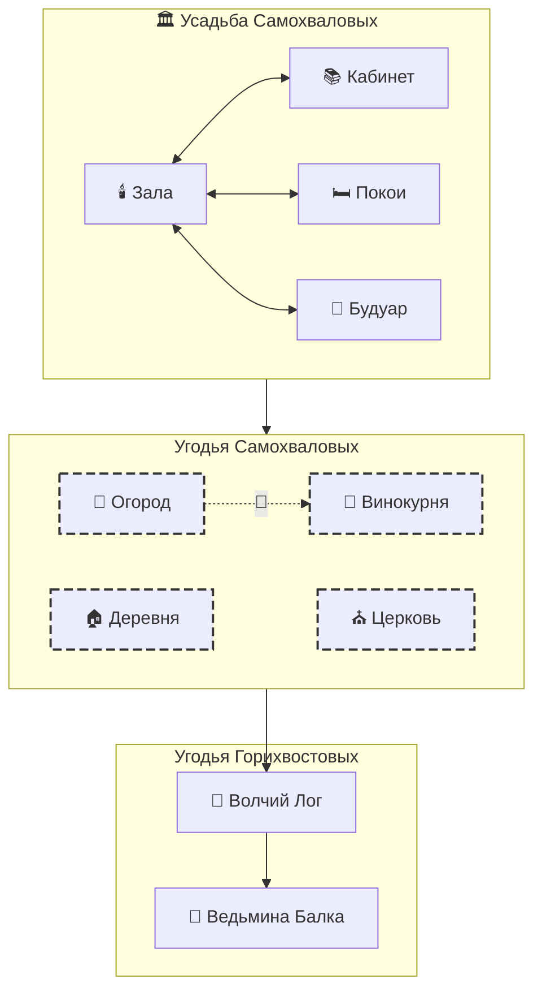

# Схема полигона

```mermaid
flowchart
    classDef dashBorder stroke:#333,stroke-width:2px,stroke-dasharray: 8 4

    subgraph Усадьба["🏛️ Усадьба Самохваловых"]
        Кабинет["📚 Кабинет"]
        Зала["🕯️ Зала"]
        Будуар["💑 Будуар"]
        Покои["🛏️ Покои"]
    end

    subgraph Хозяйство["Угодья Самохваловых"]
        Деревня["🏠 Деревня"]
        Церковь["⛪ Церковь"]
        Огород["🌿 Огород"]
        Винокурня["🍶 Винокурня"]

        class Деревня dashBorder
        class Церковь dashBorder
        class Огород dashBorder
        class Винокурня dashBorder
    end

    subgraph Дикие_земли["Угодья Горихвостовых"]
        Волчий_Лог["🐺 Волчий Лог"]
        Ведьмина_Балка["🌲 Ведьмина Балка"]
    end

    Зала <--> Кабинет
    Зала <--> Покои
    Зала <--> Будуар
    Усадьба --> Хозяйство
    Огород -.👀.-> Винокурня
    Деревня ~~~ Церковь
    Хозяйство --> Волчий_Лог
    Волчий_Лог --> Ведьмина_Балка
```
